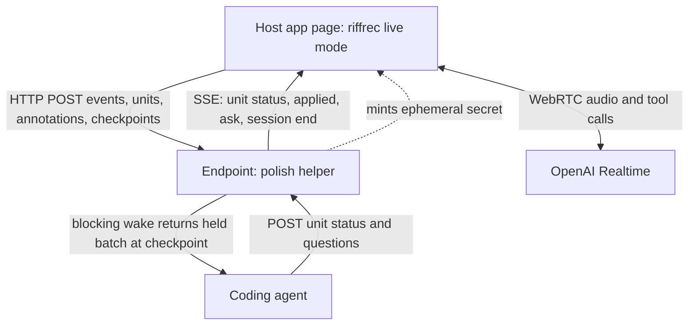
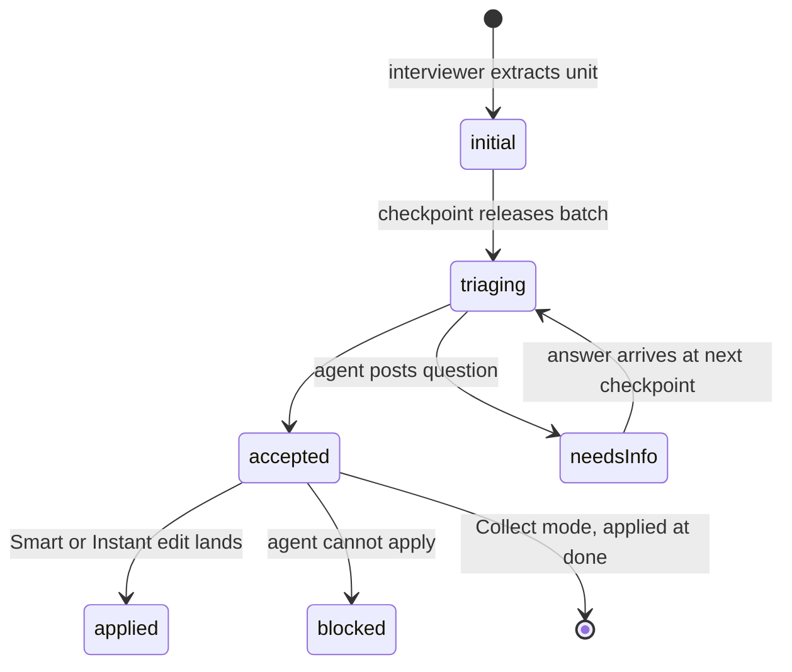

# Live Voice Mode - Plan

## Goal Capsule

- **Objective:** RiffRec gains a **live mode** that delivers a session as a stream — voice transcript, units, drawings, evidence, events — to a configured endpoint instead of a zip at `stop()`, and `ce-polish` gains a **live mode** that consumes that stream: the user's own running coding agent wakes at checkpoints with batched units and applies them per a user-selected execution mode. Both parts ship together as one work unit; neither is useful or testable without the other.
- **Product authority:** Kieran Klaassen's voice note (2026-09-14) and the brainstorm dialogue of 2026-09-14/15. Surrounding areas — the dashboard as a hosted consumer, non-React hosts, collaborator and client-tester audiences without their own agent — are not active scope (see How This Work Fits Together).
- **Open blockers:** none. Three product questions are marked Resolve Before Planning and each carries a default, so planning can proceed on the defaults if they stand.

---

## Product Contract

### Summary

Add a live mode to the `riffrec` package: a voice interviewer, a drawing layer, and a units board run inside the host app, and the session streams to an endpoint as it happens. Add a live mode to `ce-polish` that runs the local endpoint, installs riffrec when missing, wakes the running coding agent at checkpoints, and applies accepted units per an Instant / Smart / Collect switch. The dashboard becomes the second consumer later.

### Problem Frame

Today a RiffRec session is a zip you hand to an agent afterwards. Everything the person meant by "this", "here", and "that color" has to be reconstructed from a screen recording, a voice track, and an events file, minutes or hours later, by an agent that cannot ask. When the agent guesses wrong, the person finds out at PR time and re-records. Atelier's capture loop (decision D58) closes the distance by opening a Cursor pane on the zip immediately, but the agent still cannot interrupt, cannot see what was pointed at, and cannot ask "which one?" while the person is still looking at it.

Meanwhile `ce-prototype` already proves the other half: a person annotates a running page, hits Send, and a parked CLI agent wakes with the batch, applies the clear edits in place, and talks about the rest. That loop only works on isolated screens the helper serves, not on a real app, and it has no voice.

The cost shape is latency and lossy intent: feedback that was precise in the moment arrives as evidence to be interpreted, and the interpreting agent has no channel back to the person while the moment is still live.

### Key Decisions

- **RiffRec owns the capability; `ce-polish` is the first consumer; the dashboard is a later consumer.** Live mode must serve non-coding sessions (a collaborator riffing on Thinkroom with no agent attached), so the stream, overlay, voice widget, and board live in the package, and consumers only provide an endpoint. (session-settled: user-directed — chosen over a new `ce-riff` CE skill owning everything and over the dashboard-hosted original: the user did not want everything in Compound Engineering and wants streaming delivery to work outside coding.) Governs R1–R4, R27–R30.
- **The stream contract is the public API, as the zip schema is today.** Plain HTTP POST from page to endpoint, SSE from endpoint to page, and a blocking long-poll wake from endpoint to agent — the `ce-prototype` helper's three legs, kept. No WebSockets. Governs R2, R3, R31–R33.
- **A zip is a stream that was never sent.** With no endpoint configured, or an unreachable one, live mode buffers and writes today's zip at `stop()`, with transcript, units, and annotations inside. Existing zip consumers keep working. Governs R4.
- **Two brains: a Realtime voice interviewer in the browser and the consumer's coding agent.** The interviewer extracts units and asks clarifying questions the moment speech is vague; the coding agent judges and acts at checkpoints. Chosen over a single-agent loop that transcribes straight to the coding agent, which cannot ask until a checkpoint. Governs R5–R9.
- **Informed Interviewer, degrading to plain Interviewer.** When the consumer supplies a session brief (for polish: routes, component names, design tokens, recent changes, written by the coding agent at session start), the interviewer's instructions carry it so its questions are grounded in the app. Without a brief the interviewer runs on the package default persona. Recommended by the agent; not yet confirmed by the user. Governs R7, R35.
- **Two lanes.** Units appear on the board instantly and optimistically from the interviewer; the coding agent wakes only at a checkpoint. (session-settled: user-directed — chosen over continuous per-unit wake, wake only on the user's cue, and interviewer-decides-alone: speed where the user is looking, judgment where it is expensive.) Governs R10–R12, R36.
- **Checkpoints are a stream event.** The interviewer emits one when the user finishes a thought or changes pages; the overlay's Send control emits one on demand. Consumers decide what a checkpoint triggers; polish flushes held units into the agent's wake. Governs R12, R36.
- **Execution mode is a user switch in the UI: Instant, Smart, Collect.** (session-settled: user-directed — chosen over a single fixed policy.) Default is an open question, leaning Smart. Governs R37, R38.
- **Capture everything; attach a tunable evidence profile; decide the default by experiment.** (session-settled: user-directed — chosen over a fixed Lean/Rich/Everything tier: the user wants as much evidence as possible captured, screenshots rather than video on the wire, and an ablation to learn what helps the agent.) Starting default: one composited frame per unit plus structured strokes. Governs R17–R21, Success Criteria.
- **Drawing layer is a thin custom overlay on `perfect-freehand` plus the prototype's pin mechanics.** No tldraw in the package: tldraw's production license-key requirement would fall on every host app that runs riffrec live in production. Excalidraw stays an optional host-provided adapter later. (session-settled: user-directed — chosen over tldraw SDK and Excalidraw: no production license or key may be imposed on host apps, and the package must stay light enough to ship into every fleet app.) Governs R13–R16.
- **Full loop in v1, no staged slice.** Voice interviewer, units board, drawing overlay, agent wake, and the execution-mode switch ship together. (session-settled: user-directed — chosen over any single-slice first cut.) Scope risk: this is five surfaces across two repositories landing at once; the plan accepts it and names it here once.
- **R17 of the original RiffRec requirements is rewritten, not deleted.** The package still holds no long-lived key and makes no server-side LLM calls; the voice widget connects to OpenAI Realtime from the browser using an ephemeral secret the endpoint mints. Governs R5, R28.
- **Coverage is React-first.** The package stays React-first; the overlay, board, and voice widget are built framework-agnostic under the hood so a plain script embed is a follow-on, not a rewrite. Assumed by the agent; the user's whole fleet is React. Governs R29.
- **Remote sessions are first-class.** The endpoint and dev server may run on a different machine than the browser, reached over a LAN, Tailscale, or a TLS-terminating tunnel, following the prototype's host-follows-the-browser mechanics. Governs R40–R42.

<!-- ce-section: work-relationships -->
### How This Work Fits Together

This plan owns RiffRec live mode and `ce-polish` live mode as one unit. The breakdown below is the current understanding, not a committed roadmap.

- **Dashboard as second consumer** — Depends on this plan's stream contract. The dashboard receives the stream instead of a zip, a hosted Cursor agent triages, and `/integrate/:stack` teaches live-mode configuration. Still to decide: whether to reverse the dashboard's KTD12 (polling over SSE) or mirror local sessions only. Serves collaborators without an agent and clients' testers.
- **Framework-agnostic embed** — Enables non-React hosts. Can proceed independently once the overlay's internal boundary is in place (R29).
- **Fleet rollout via compound-stack-rails** — Depends on the riffrec release; ships as an agent-executable changelog entry so upgrade agents add live-mode configuration to every fleet app.
- **`ce-riffrec-feedback-analysis`** — Shares the zip fallback (R4); no change required, and its Setup route may point at `ce-polish` live mode later.
- **Atelier capture loop (D58) and Thinkroom feedback runs** — Can proceed independently; they consume zips and are unaffected by R4.

### Actors

- A1. **Riffer** — the person using the host app while talking and drawing. In v1 usually the developer who owns the repo and runs the coding agent; may be a collaborator at the same keyboard or on the same network.
- A2. **Voice interviewer** — the OpenAI Realtime agent running in the browser inside riffrec live mode. Extracts units, asks clarifying questions, emits checkpoints, voices the coding agent's follow-ups.
- A3. **Coding agent** — the riffer's own running CLI agent (Claude Code, Codex, Cursor, or another harness) executing `ce-polish` live mode. Wakes at checkpoints, triages, applies, asks.
- A4. **Endpoint** — the consumer's receiver for the stream. For polish, the local helper the skill runs; later, the dashboard or a host app's own server.
- A5. **Host app** — the React application riffrec is installed in and polish is running.

### Requirements

**RiffRec live mode — session and delivery**

- R1. Live mode is a first-class session mode of the `riffrec` package, activated by configuration on the provider, with the host app choosing when the riffer can start it.
- R2. A live session delivers its events to one configured endpoint as they happen, using the stream contract in R31–R33.
- R3. The stream carries today's event union (clicks with selector, component, bounding box and nearby context; navigation; network outcomes; console errors) plus the new event kinds: transcript, unit, unit status, annotation, checkpoint, question, and answer.
- R4. With no endpoint configured, or when the endpoint is unreachable, the session buffers locally and `stop()` produces today's zip with transcript, units, and annotations added beside `events.json`; media and event schema stay compatible with existing consumers.

**RiffRec live mode — voice interviewer**

- R5. The voice widget connects to OpenAI Realtime from the browser using an ephemeral secret minted by the endpoint; the package never holds a long-lived key.
- R6. The interviewer listens continuously while the session is live and can be muted by the riffer at any time.
- R7. The interviewer extracts units from speech, asks a clarifying question immediately when an instruction is ambiguous, and accepts a consumer-supplied brief and tool set that shape its questions and vocabulary.
- R8. The interviewer voices questions that arrive from the endpoint only at a natural pause in the riffer's speech, never mid-thought.
- R9. The interviewer runs in a conversation mode where the riffer can interrupt it.

**RiffRec live mode — units and board**

- R10. A unit is one requested change with a stable id, the riffer's words, a normalized statement, its anchors (route and the elements pointed at, clicked, or drawn on), attached evidence per the profile in R19, and a status.
- R11. Unit status follows initial → triaging → accepted or needs-info, plus applied and blocked when a consumer acts; the board shows the current status of every unit and the question attached to a needs-info unit.
- R12. Units appear on the board the moment the interviewer extracts them, as initial; endpoint status updates overwrite by id. A checkpoint marks the point up to which held units are released to the consumer, emitted by the interviewer at a finished thought or a page change and by the overlay's Send control on demand.

**RiffRec live mode — drawing and annotation**

- R13. A shortcut or overlay control toggles a drawing layer over the whole host app; while it is on, pointer input draws instead of operating the app, and toggling it off restores the app.
- R14. Strokes are freehand with a hand-drawn feel; a pin places a typed or spoken note on an element.
- R15. Every stroke and pin is anchored: its points, its bounding box, the element it lands on as selector and component when available, that element's rect, and the route.
- R16. Drawing made while a unit is being spoken attaches to that unit; drawing made in silence becomes its own unit with the drawing as the statement.

**RiffRec live mode — evidence**

- R17. The session records the screen for its whole duration and keeps that recording local, available to the zip path; video is never sent over the stream.
- R18. The session captures a screenshot when a unit is extracted and periodically on an interval, plus a composited frame of the current view with the riffer's strokes drawn on it whenever an annotation completes.
- R19. What attaches to a unit on the wire is an evidence profile the consumer declares per session; the starting default is transcript excerpt, anchors, structured strokes, and one composited frame.
- R20. Every attached artifact is unambiguous to a coding agent: images carry the route and timestamp, strokes carry their anchors, and structured data and images that describe the same annotation cross-reference by id.
- R21. A ±10s window of network and console events and a short audio clip of the utterance are available in the profile for consumers that want them.

**RiffRec live mode — privacy and consent**

- R22. Before a live session starts, the riffer sees and accepts what will be streamed and to whom: microphone audio to OpenAI, transcript, screenshots, and events to the named endpoint.
- R23. A visible live indicator is present for the whole session and shows when the microphone is muted.
- R24. Existing production guards apply unchanged: live mode is disabled in production unless the host opts in, and credential-like parameters are redacted from every streamed URL.
- R25. Screenshots and frames exclude nothing automatically; the consent copy says so, and the riffer can pause capture.
- R26. A collaborator session inherits the same consent flow and indicator; the endpoint owner is named in the consent copy.

**RiffRec live mode — compatibility and distribution**

- R27. The zip format, the host-managed output contract (`download`, `onSessionComplete`), and the existing recorder UI keep working for hosts that do not enable live mode.
- R28. The package documents that live mode connects to OpenAI Realtime from the browser and how an endpoint mints the ephemeral secret; the README's "does not call an LLM" statement is replaced accordingly.
- R29. The overlay, board, and voice widget keep a framework-agnostic core behind the React surface so a script embed can follow without a rewrite.
- R30. compound-stack-rails receives an agent-executable changelog entry that enables live mode in fleet apps.

**Stream contract**

- R31. Page → endpoint: HTTP POST of small JSON event envelopes with client sequence numbers, retried on failure, authenticated by a per-session token the endpoint issued.
- R32. Endpoint → page: a server-sent event stream carrying unit status updates, applied notices, questions for the interviewer to voice, and session end.
- R33. Endpoint → agent: one blocking long-poll wake that returns the batch of held units and annotations since the last checkpoint, exit 0; session ended, exit 1; error, exit 2 — the `ce-prototype` helper's contract.

**ce-polish live mode — start**

- R34. At the start of Run, before the dev server starts, `ce-polish` asks once: live or traditional. Traditional is today's loop unchanged. Live checks its preconditions — an OpenAI key in the environment and a microphone — and reports what is missing instead of starting.
- R35. Live mode starts the local endpoint, installs riffrec into the host app when it is missing as a setup commit on the current feature branch, configures live mode to point at the endpoint, hands the riffer the verified URL, and writes the session brief for the interviewer.

**ce-polish live mode — agent wake and execution modes**

- R36. The coding agent parks on the wake and receives the held batch at each checkpoint; it never acts on units before a checkpoint.
- R37. The execution mode is a switch on the overlay with three positions: **Instant** applies each accepted unit as soon as it is accepted, in parallel where units are independent; **Smart** applies clear bounded edits at each checkpoint, turns ambiguous units into questions, and sends units larger than polish to the residual list; **Collect** applies nothing during the riff and applies the accepted batch as one pass when the riffer says done.
- R38. Applied edits land on the current feature branch with hot reload; the live session — voice, board, strokes, pins — survives a page reload, and the interviewer re-seeds its context from the transcript when its connection is replaced.
- R39. Every question the coding agent has for the riffer is posted to the endpoint and voiced per R8; the agent never parks a wake while its own question is unanswered.

**ce-polish live mode — remote sessions**

- R40. The endpoint and dev server may run on a different machine than the browser; the skill can bind the endpoint on all interfaces and hand the riffer a URL with only the host rewritten, disclosing that the run directory is reachable on that network.
- R41. The overlay reaches the host app and the endpoint over an origin pair the skill states plainly; POST, SSE, and the agent wake all work through proxies and tunnels.
- R42. When the browser is not on localhost, the URL the riffer opens is HTTPS so microphone and screen capture are permitted; the skill tells the riffer this when the tunnel does not terminate TLS.

**ce-polish live mode — session end**

- R43. When the riffer says done, polish applies per the active mode, commits via `ce-commit`, and reports the commits, the still-running URL, and a **residual list**: units that were needs-info, blocked, or beyond polish, written where the riffer can hand them to planning.
- R44. The riff — transcript, units with status, annotations, and the evidence profile used — is kept as a local session log under the run's scratch directory; nothing is pushed or opened as a PR.

### Key Flows

- F1. **Start a live polish session**
  - **Trigger:** The riffer runs `/ce-polish` on a feature branch.
  - **Actors:** A1, A3, A4, A5
  - **Steps:** Polish resolves the workspace and asks live or traditional. Live checks preconditions, starts the endpoint, installs riffrec if missing, starts or attributes the dev server, writes the brief, hands over the URL. The riffer opens it, sees the consent screen, accepts, and the interviewer greets them.
  - **Covered by:** R1, R5, R22, R34, R35

- F2. **Riff to applied change**
  - **Trigger:** The riffer says "this toggle should live up in the header" while pointing at it.
  - **Actors:** A1, A2, A3, A4
  - **Steps:** The interviewer extracts a unit with the clicked element as anchor; the board shows it as initial. The riffer draws a circle and an arrow; the strokes attach to the unit with a composited frame. The riffer moves on to another page; the interviewer emits a checkpoint. The endpoint releases the batch; the coding agent wakes, triages the unit as accepted, applies it (Smart), posts applied; the board updates; the interviewer says "moved — reload when you like."
  - **Covered by:** R10–R12, R15, R16, R18, R36–R38

- F3. **Question routed back**
  - **Trigger:** The coding agent finds two header variants and cannot choose.
  - **Actors:** A1, A2, A3, A4
  - **Steps:** The agent posts a question on the unit; the unit shows needs-info with the question. The interviewer waits for the riffer to finish their current thought, voices the question, captures the answer as an answer event, and the next checkpoint carries it back. The agent does not park its wake until the answer arrives.
  - **Covered by:** R8, R11, R39

- F4. **No endpoint**
  - **Trigger:** A host app enables live mode with no endpoint, or the endpoint stops answering mid-session.
  - **Actors:** A1, A2, A5
  - **Steps:** The interviewer keeps extracting units; the board keeps showing them as initial. Events buffer locally. At `stop()`, the session writes the zip with transcript, units, and annotations inside, and the download notice tells the riffer to share it.
  - **Covered by:** R4, R27

- F5. **Remote session**
  - **Trigger:** The agent and dev server run on the Mac mini; the riffer's browser is on a laptop.
  - **Actors:** A1, A3, A4
  - **Steps:** Polish binds the endpoint on all interfaces, rewrites only the host in the URL, states the app and endpoint origins, and warns that the browser needs HTTPS to capture microphone and screen. The riffer opens the tunnel URL; consent, streaming, SSE, and the agent wake proceed as in F1–F3.
  - **Covered by:** R40–R42

### Acceptance Examples

- AE1. **Covers R12, R36.** Given the riffer has spoken three units on one page, when they navigate to another page, then the interviewer emits a checkpoint, the three units are released as one batch, and the coding agent wakes once.
- AE2. **Covers R37.** Given execution mode is Collect, when the coding agent wakes with an accepted unit, then nothing in the app changes until the riffer says done, and the unit stays accepted on the board.
- AE3. **Covers R37.** Given execution mode is Smart, when a unit reads "make this red" with a clear anchor, then the agent applies it at the checkpoint; when a unit reads "rethink the onboarding flow", then it goes to the residual list and the board shows it as blocked with that reason.
- AE4. **Covers R16.** Given the riffer draws a box around a card while saying nothing, when the stroke completes, then a unit is created whose statement is the drawing and whose anchor is the card's selector.
- AE5. **Covers R4.** Given a host enables live mode without an endpoint, when the riffer stops, then the downloaded zip contains `events.json`, the recording, transcript, units, and annotations, and `ce-riffrec-feedback-analysis` reads it without changes.
- AE6. **Covers R8, R39.** Given the coding agent posts a question while the riffer is mid-sentence, when the riffer finishes the sentence, then the interviewer voices the question and not before.
- AE7. **Covers R38.** Given Smart mode applies an edit that triggers a full page reload, when the page comes back, then the board, strokes, and pins are still there and the interviewer resumes without asking the riffer to repeat themselves.
- AE8. **Covers R34.** Given no OpenAI key in the environment, when the riffer picks live, then polish names the missing key and offers traditional instead of starting a session.
- AE9. **Covers R42.** Given the endpoint is on another machine reached over plain HTTP, when polish hands over the URL, then it says microphone and screen capture will be refused until the URL is HTTPS.

### Success Criteria

- A riffer on Thinkroom can talk and draw for five minutes and end with applied commits for the clear units, a spoken answer for every ambiguous one, and a residual list for the rest — without opening a terminal.
- Every applied change traces to a unit whose anchors name the element that was pointed at; no applied change traces to a guess about "this" or "here".
- **Evidence ablation:** the same recorded riff is replayed to the coding agent under at least three evidence profiles (anchors only; anchors + composited frame; everything), and triage accuracy and applied-change correctness are compared. The winning profile becomes the default in R19 and the plan is updated to say so.
- A collaborator at the riffer's machine can run a session without seeing a key, a token, or a terminal.
- Hosts that never enable live mode see no change in bundle behavior and no new network calls.

### Scope Boundaries

**Deferred for later**

- The dashboard as a hosted consumer: live streams to dashboard.riffrec.com, a hosted Cursor agent triaging, mirroring local sessions to the board. With it, collaborators without an agent and clients' testers.
- A framework-agnostic script embed for non-React hosts.
- Excalidraw as a host-provided adapter for full-canvas sketching.
- Per-unit voice overrides ("just do it", "note it") layered on the execution mode.
- A clean, un-annotated frame alongside the composited one if strokes prove to occlude what matters.

**Outside this product's identity**

- A browser extension or bookmarklet as the overlay carrier.
- Riffrec Desktop as the live-mode carrier.
- An injecting proxy in front of the dev server.
- Any CE-hosted relay or telemetry; the endpoint is always the user's own or a host they chose.
- Autonomous review or QA during a riff; the coding agent acts only on what the riffer asked.

### Dependencies / Assumptions

- OpenAI Realtime API with ephemeral client secrets, WebRTC connection, input transcription, semantic turn detection, and function tools, as used in `breathwork-live`. The Realtime session cannot be resumed after disconnect; R38 depends on re-seeding from the transcript.
- The riffer's OpenAI key lives in their shell environment for polish sessions; the value from `breathwork-live` is reused by exporting it, never by reading that app's configuration.
- `ce-prototype`'s helper is copied into `ce-polish`, not imported; CE skills are self-contained.
- A parked CLI agent is single-threaded; Instant mode's parallelism comes from the agent spawning work, not from the wake returning more than once.
- Host apps in the fleet run riffrec with `forceEnable` in production; live-mode consent and indicator requirements assume that posture.
- Hot reload keeps the page's JavaScript state on most edits; full reloads are the case R38 covers.
- Evidence: the pain of the zip flow is asserted from the user's experience and Atelier D58, not from measured sessions; the ablation in Success Criteria is the first measurement.

### Outstanding Questions

**Resolve Before Planning**

- Default execution mode. Leaning Smart; Collect is the safe alternative.
- Informed Interviewer or plain Interviewer as the v1 behavior when a brief is available. Recommended: Informed.
- Whether the riffrec setup commit stays on the polish feature branch or lands first on its own branch.

**Deferred to Planning**

- The freehand implementation within the constraints in Key Decisions (`perfect-freehand` leaning), stroke-to-element anchoring heuristics, and the pin composer.
- Event and unit schemas, sequence and retry semantics, and how the endpoint issues the session token.
- Checkpoint heuristics: silence threshold, page change, and how Send interacts with an in-progress utterance.
- Periodic screenshot cadence, frame resolution, and the composite rendering path.
- Session brief content and size cap; how a non-polish consumer supplies one.
- Realtime reconnection after reload and how much transcript re-seeds the interviewer.
- Which framework recipes in `ce-polish` can host riffrec live mode, and what the skill says on a non-React project.
- Tunnel guidance in the skill: Tailscale serve, cloudflared, ngrok; whether the helper gains a TLS option or relies on the tunnel.
- Board rendering inside the overlay and the terminal mirror the coding agent sees.

### Sources / Research

- `docs/requirements.md` — original RiffRec requirements, including R17 and the "no real-time analysis" boundary this plan revises.
- `README.md` — session format and host-managed output contract; line 7 changes under R28.
- `src/RiffrecProvider.tsx`, `src/RiffrecRecorder.tsx`, `src/types.ts`, `src/capture/element.ts` — production guard, `download`/`onSessionComplete`, click anchors.
- Repository `EveryInc/compound-engineering-plugin`: `skills/ce-polish/SKILL.md` and `references/run.md` (the traditional loop and startup tuple); `skills/ce-prototype/scripts/light-webserver.js`, `assets/annotate.js`, `references/annotation-loop.md`, `references/preview.md` (the endpoint pattern this plan copies); `skills/ce-riffrec-feedback-analysis/` (the zip consumer); `STRATEGY.md` (no telemetry, bring your own harness).
- Repository `kieranklaassen/breathwork-live`: `app/services/openai/realtime_secrets.rb`, `app/frontend/lib/breathwork/realtimeClient.ts`, `app/services/breathwork/agent_tools.rb`, `docs/solutions/realtime-voice-session-architecture.md` — the Realtime pattern, the `watch` frame tool, and the dropped-transcript lesson.
- Repository `kieranklaassen/riffrec-dashboard`: `AGENTS.md`, `docs/plans/2026-07-15-002-feat-extract-run-pipeline-plan.md` (KTD12: polling over SSE), `config/routes.rb` (`/integrate/:stack`).
- Repository `kieranklaassen/compound-stack-rails`: `README.md`, `config/initializers/riffrec.rb`, `docs/changelog/` — the fleet rollout mechanism.
- Repository `kieranklaassen/atelier`: `docs/decisions.md` D58 and D60.
- tldraw licensing: tldraw.dev, "20 things I wish AI chatbots knew about tldraw" — production use requires a license key since SDK 4.0.
