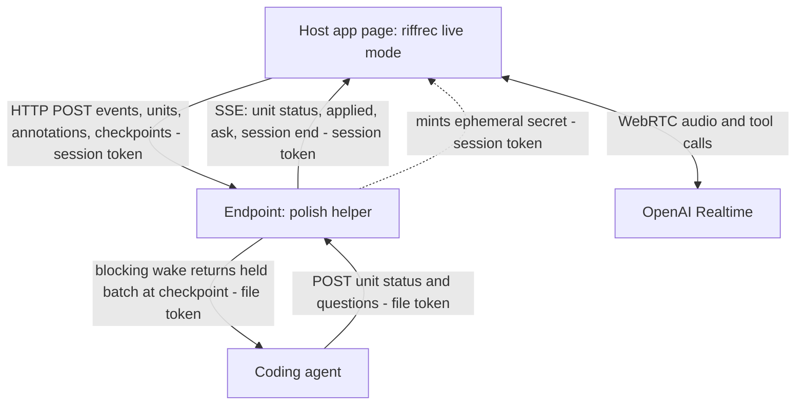
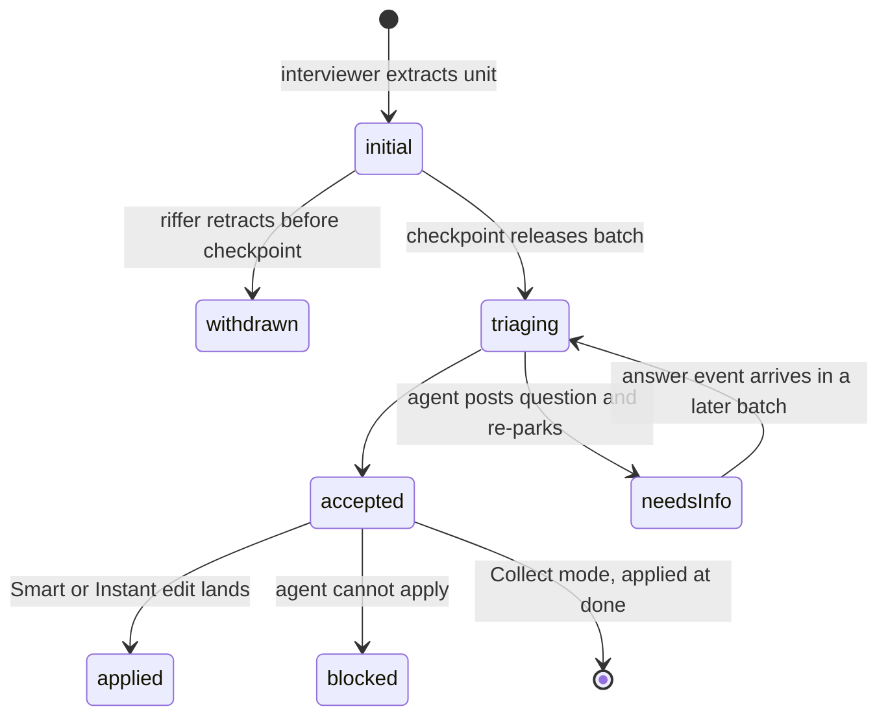
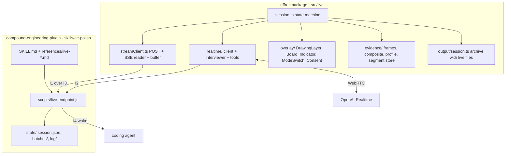
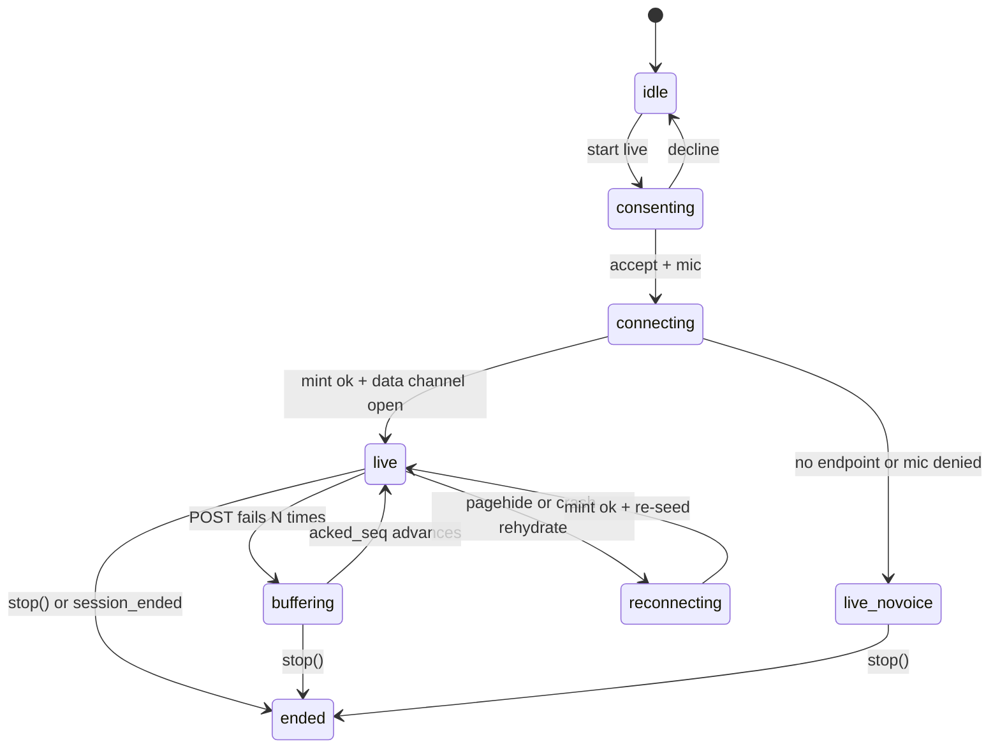
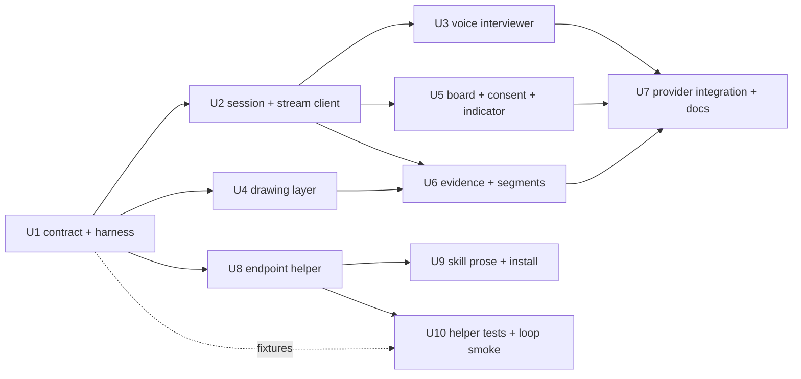

# Live Voice Mode - Plan

## Goal Capsule

- **Objective:** RiffRec gains a **live mode** that delivers a session as a stream — voice transcript, units, drawings, evidence, events — to a configured endpoint instead of a zip at `stop()`, and `ce-polish` gains a **live mode** that consumes that stream: the user's own running coding agent wakes at checkpoints with batched units and applies them per a user-selected execution mode. Both parts ship together as one work unit; the stream has no consumer without polish, and polish has no stream without riffrec.
- **Product authority:** Kieran Klaassen's voice note (2026-09-14) and the brainstorm dialogue of 2026-09-14/15, revised after the document review of 2026-09-15. Then this plan's Planning Contract, then each target repo's conventions (`README.md` and `docs/requirements.md` in riffrec; `AGENTS.md` in the Compound Engineering plugin). Surrounding areas — the dashboard as a hosted consumer, non-React hosts, fleet rollout, collaborator and client-tester audiences without their own agent — are not active scope (see How This Work Fits Together).
- **Execution profile:** two repositories, ten units. Units U1 (contract and test harness), U8 (endpoint helper), and U9 (skill prose) start now; the rest follow the dependency graph in the Planning Contract. Each unit is written to be executed by a separate agent in a fresh clone of its repository.
- **Stop conditions:** stop and report if the OpenAI Realtime API no longer offers browser-side ephemeral client secrets with function tools; if `perfect-freehand`'s license or size changes such that KD "Drawing layer" cannot hold; if the Compound Engineering plugin's skill-conventions test forbids a bundled Node helper under `skills/ce-polish/scripts/`; or if implementing any session-settled decision proves infeasible (report with the token `settled-decision-invalidated`).
- **Tail ownership:** each unit's implementer runs its Verification Contract gates and satisfies its test scenarios; the riffrec release (U7) and the CE plugin release (U10) each end with their repo's full gate green; the cross-repo smoke in Definition of Done is run by whoever lands the second of the two releases.
- **Product Contract preservation:** restructured, no scope change. Requirements, Actors, Flows, and Acceptance Examples are unchanged from the reviewed 2026-09-15 text. Three Key Decisions that carried an open default (execution mode, Informed Interviewer, setup-commit branch) now state the default as resolved per KTD11, KTD13, KTD14 — the user directed planning to proceed on the defaults. Outstanding Questions' planning-owned items moved into KTDs or Deferred to Implementation; the review's `Deferred / Open Questions` entry (mode switch mid-session) is resolved in KTD12 and removed; Scope Boundaries gained a `Deferred to Follow-Up Work` list.

---

## Product Contract

### Summary

Add a live mode to the `riffrec` package: a voice interviewer, a drawing layer, and a units board run inside the host app, and the session streams to an endpoint as it happens. Add a live mode to `ce-polish` that runs the local endpoint, installs riffrec when missing, wakes the running coding agent at checkpoints, and applies accepted units per an Instant / Smart / Collect switch. The dashboard becomes the second consumer later.

### Problem Frame

Today a RiffRec session is a zip you hand to an agent afterwards. Everything the person meant by "this", "here", and "that color" has to be reconstructed from a screen recording, a voice track, and an events file, minutes or hours later, by an agent that cannot ask. When the agent guesses wrong, the person finds out at PR time and re-records. Atelier's capture loop (decision D58) closes the distance by opening a Cursor pane on the zip immediately, but the agent still cannot interrupt, cannot see what was pointed at, and cannot ask "which one?" while the person is still looking at it.

Meanwhile `ce-prototype` already proves the other half: a person annotates a running page, hits Send, and a parked CLI agent wakes with the batch, applies the clear edits in place, and talks about the rest. That loop only works on isolated screens the helper serves, not on a real app, and it has no voice.

The cost shape is latency and lossy intent: feedback that was precise in the moment arrives as evidence to be interpreted, and the interpreting agent has no channel back to the person while the moment is still live.

### Key Decisions

- **RiffRec owns the capability; `ce-polish` is the first consumer; the dashboard is a later consumer.** Live mode must serve non-coding sessions (a collaborator riffing on Thinkroom with no agent attached), so the stream, overlay, voice widget, and board live in the package, and consumers only provide an endpoint. A collaborator with no agent gets the voice interviewer only once a consumer that mints Realtime secrets exists — a host app's own server or the dashboard; until then such a host runs the drawing layer, board, and recorder without voice. (session-settled: user-directed — chosen over a new `ce-riff` CE skill owning everything and over the dashboard-hosted original: the user did not want everything in Compound Engineering and wants streaming delivery to work outside coding.) Governs R1–R4, R27–R29.
- **The stream contract is the public API, as the zip schema is today.** Plain HTTP POST from page to endpoint, SSE from endpoint to page, and a blocking long-poll wake from endpoint to agent — the `ce-prototype` helper's three legs, kept. No WebSockets. Every route the endpoint exposes requires a credential, and the contract is versioned like the zip schema. Governs R2, R3, R30–R33.
- **A zip is a stream that was never sent.** `stop()` always assembles today's archive, recording included, and honors `download` and `onSessionComplete`. With no endpoint configured no interviewer runs, because nothing can mint its secret, and the archive adds annotations. When an endpoint becomes unreachable mid-session the interviewer continues on its open connection, events buffer locally, and the archive adds transcript, units, and annotations. Existing zip consumers keep working. Governs R4.
- **Two brains: a Realtime voice interviewer in the browser and the consumer's coding agent.** The interviewer extracts units and asks clarifying questions the moment speech is vague; the coding agent judges and acts at checkpoints. Chosen over a single-agent loop that transcribes straight to the coding agent, which cannot ask until a checkpoint. Governs R5–R9.
- **OpenAI Realtime is the sole v1 voice provider.** Chosen for ephemeral client secrets, WebRTC, semantic turn detection, and function tools proven in `breathwork-live`. Live polish therefore needs an OpenAI account in addition to the user's coding-agent provider; other voice providers behind a provider boundary are deferred. Governs R5, R34.
- **Informed Interviewer, degrading to plain Interviewer.** When the consumer supplies a session brief (for polish: routes, component names, design tokens, recent changes, written by the coding agent at session start), the interviewer's instructions carry it so its questions are grounded in the app. The brief is non-secret app metadata — never environment values, credentials, or user data — and it is sent to OpenAI as session instructions. Without a brief the interviewer runs on the package default persona. Adopted for v1 on the brainstorm's stated default (KTD13). Governs R7, R35.
- **The v1 interviewer hears and reads; it does not see.** Audio and text only. A consumer-supplied tool set may not carry image content; frames go to the endpoint, never to OpenAI. A frame-seeing interviewer is deferred until the ablation shows whether frames help the coding agent. Governs R7, R22.
- **Two lanes.** Units appear on the board instantly and optimistically from the interviewer; the coding agent wakes only at a checkpoint. (session-settled: user-directed — chosen over continuous per-unit wake, wake only on the user's cue, and interviewer-decides-alone: speed where the user is looking, judgment where it is expensive.) Governs R10–R12, R36.
- **Checkpoints are a stream event, coarser than an utterance.** The interviewer emits one when the riffer falls silent for longer than a threshold set in planning, or changes pages; the overlay's Send control emits one on demand. One sentence per change must not become one wake per unit. Consumers decide what a checkpoint triggers; polish flushes held units into the agent's wake. Governs R12, R36.
- **Execution mode is a user switch in the UI: Instant, Smart, Collect.** All three act at checkpoint cadence; they differ in what the agent does with a batch, not when. (session-settled: user-directed — chosen over a single fixed policy.) Default is Smart (KTD11). Governs R37, R38.
- **Capture everything; attach a tunable evidence profile; decide the default by experiment.** (session-settled: user-directed — chosen over a fixed Lean/Rich/Everything tier: the user wants as much evidence as possible captured, screenshots rather than video on the wire, and an ablation to learn what helps the agent.) Starting default on the wire: transcript excerpt, anchors, structured strokes, one composited frame. Anchors are part of every unit regardless of profile. Governs R10, R17–R21, Success Criteria.
- **Drawing layer is a thin custom overlay on `perfect-freehand` plus the prototype's pin mechanics.** No tldraw in the package: tldraw's production license-key requirement would fall on every host app that runs riffrec live in production. Excalidraw stays an optional host-provided adapter later. (session-settled: user-directed — chosen over tldraw SDK and Excalidraw: no production license or key may be imposed on host apps, and the package must stay light enough to ship into every fleet app.) Governs R13–R16.
- **Full loop in v1, no staged slice.** Voice interviewer, units board, drawing overlay, agent wake, and the execution-mode switch ship together. (session-settled: user-directed — chosen over any single-slice first cut.) Scope risk: this is five surfaces across two repositories landing at once; the plan accepts it and names it here once.
- **R17 of the original RiffRec requirements is rewritten, not deleted.** The package still holds no long-lived key and makes no server-side LLM calls; the voice widget connects to OpenAI Realtime from the browser using an ephemeral secret the endpoint mints. Governs R5, R28.
- **Coverage is React-first.** The package stays React-first. Avoid gratuitous React coupling in the overlay, board, and voice widget, but no maintained framework-agnostic boundary is required in v1; the script embed stays deferred. Resolved after review against the agent's earlier assumption of a required boundary. Governs R29.
- **Installing riffrec is a disclosed, permanent setup commit.** Live polish tells the riffer, before installing, that live mode adds riffrec to the app as a dependency and a provider mount, committed on the current branch; riffrec stays after the session, matching the fleet posture. The commit lands on the current feature branch (KTD14). Governs R34, R35.
- **Remote sessions are first-class.** The endpoint and dev server may run on a different machine than the browser, reached over a LAN, Tailscale, or a TLS-terminating tunnel, following the prototype's host-follows-the-browser mechanics; when the page is HTTPS, the endpoint origin is HTTPS too. Governs R40–R42.

<!-- ce-section: work-relationships -->
### How This Work Fits Together

This plan owns RiffRec live mode and `ce-polish` live mode as one unit. The breakdown below is the current understanding, not a committed roadmap.

- **Dashboard as second consumer** — Depends on this plan's stream contract. The dashboard receives the stream instead of a zip, mints Realtime secrets for hosts that have no server of their own, a hosted Cursor agent triages, and `/integrate/:stack` teaches live-mode configuration. Still to decide: whether to reverse the dashboard's KTD12 (polling over SSE) or mirror local sessions only. Serves collaborators without an agent and clients' testers, and is what gives a no-agent host the voice interviewer.
- **Framework-agnostic embed** — Enables non-React hosts. Can proceed independently; it introduces the framework boundary R29 no longer requires in v1.
- **Fleet rollout via compound-stack-rails** — Depends on the riffrec release; owns the agent-executable changelog entry. Template-derived apps ship a no-op riffrec stub at a drop-in point keyed on `RIFFREC_ENDPOINT`, so the entry installs the real package there, maps that configuration to the live-mode endpoint, and enables live mode. Not a requirement of this plan.
- **`ce-riffrec-feedback-analysis`** — Shares the zip fallback (R4); no change required, and its Setup route may point at `ce-polish` live mode later.
- **Atelier capture loop (D58) and Thinkroom feedback runs** — Can proceed independently; they consume zips and are unaffected by R4.

### Actors

- A1. **Riffer** — the person using the host app while talking and drawing. In v1 usually the developer who owns the repo and runs the coding agent; may be a collaborator at the same keyboard or on the same network.
- A2. **Voice interviewer** — the OpenAI Realtime agent running in the browser inside riffrec live mode. Extracts units, asks clarifying questions, emits checkpoints, voices the coding agent's follow-ups.
- A3. **Coding agent** — the riffer's own running CLI agent (Claude Code, Codex, Cursor, or another harness) executing `ce-polish` live mode. Wakes at checkpoints, triages, applies, asks.
- A4. **Endpoint** — the consumer's receiver for the stream and the minter of the interviewer's secret. For polish, the local helper the skill runs; later, the dashboard or a host app's own server.
- A5. **Host app** — the React application riffrec is installed in and polish is running.

### Requirements

**RiffRec live mode — session and delivery**

- R1. Live mode is a first-class session mode of the `riffrec` package, activated by configuration on the provider, with the host app choosing when the riffer can start it.
- R2. A live session delivers its events to one configured endpoint as they happen, using the stream contract in R30–R33.
- R3. The stream carries today's event union (clicks with selector, component, bounding box and nearby context; navigation; network outcomes; console errors) plus the new event kinds: transcript, unit, unit status, annotation, checkpoint, question, and answer.
- R4. `stop()` always assembles today's archive with the recording and honors `download` and `onSessionComplete`. With no endpoint configured the interviewer does not run and the archive adds annotations beside `events.json`. When the endpoint becomes unreachable mid-session the interviewer continues, events buffer locally, and the archive adds transcript, units, and annotations. Media and event schema stay compatible with existing consumers.

**RiffRec live mode — voice interviewer**

- R5. The voice widget connects to OpenAI Realtime from the browser using an ephemeral secret minted by the endpoint; the package never holds a long-lived key, and no provider configuration option accepts one.
- R6. The interviewer listens continuously while the session is live and can be muted by the riffer at any time.
- R7. The interviewer extracts units from speech, asks a clarifying question immediately when an instruction is ambiguous, and accepts a consumer-supplied brief and tool set that shape its questions and vocabulary; the brief carries no secrets, environment values, or user data, and the tool set carries no image content.
- R8. The interviewer voices questions that arrive from the endpoint only at a natural pause in the riffer's speech, never mid-thought.
- R9. The interviewer runs in a conversation mode where the riffer can interrupt it.

**RiffRec live mode — units and board**

- R10. A unit is one requested change with a stable id, the riffer's words, a normalized statement, its anchors (route and the elements pointed at, clicked, or drawn on — always present), attached evidence per the profile in R19, and a status.
- R11. Unit status follows initial → triaging → accepted or needs-info, plus applied and blocked when a consumer acts, and withdrawn when the riffer retracts a unit before its checkpoint; the board shows the current status of every unit, strikes through withdrawn ones, and shows the question attached to a needs-info unit.
- R12. Units appear on the board the moment the interviewer extracts them, as initial; endpoint status updates overwrite by id. A checkpoint marks the point up to which held units are released to the consumer, emitted by the interviewer when the riffer falls silent for longer than a threshold set in planning or changes pages, and by the overlay's Send control on demand; withdrawn units are excluded from the batch.

**RiffRec live mode — drawing and annotation**

- R13. A shortcut or overlay control toggles a drawing layer over the whole host app; while it is on, pointer input draws instead of operating the app, and toggling it off restores the app.
- R14. Strokes are freehand with a hand-drawn feel; a pin places a typed or spoken note on an element.
- R15. Every stroke and pin is anchored: its points, its bounding box, the element it lands on as selector and component when available, that element's rect, and the route.
- R16. Drawing made while a unit is being spoken attaches to that unit; drawing made in silence becomes its own unit with the drawing as the statement.

**RiffRec live mode — evidence**

- R17. The session records the screen locally for the zip path, segmented at full page reloads: segments are persisted as they are produced, the archive includes every segment, and after a reload the overlay asks the riffer once to re-share the screen before capture resumes. Video is never sent over the stream.
- R18. The session captures a screenshot when a unit is extracted and periodically on an interval, plus a composited frame of the current view with the riffer's strokes drawn on it whenever an annotation completes.
- R19. What attaches to a unit on the wire is an evidence profile the consumer declares per session; the starting default is transcript excerpt, anchors, structured strokes, and one composited frame.
- R20. Every attached artifact is unambiguous to a coding agent: images carry the route and timestamp, strokes carry their anchors, and structured data and images that describe the same annotation cross-reference by id.
- R21. A ±10s window of network and console events and a short audio clip of the utterance are available in the profile for consumers that want them.

**RiffRec live mode — privacy and consent**

- R22. Before a live session starts, the riffer sees and accepts what will be streamed and to whom, derived from the active evidence profile: microphone audio and the session brief to OpenAI; transcript, screenshots, frames, events, and any profile-enabled audio clips or telemetry windows to the named endpoint. The consent step requests microphone access; a missing or denied microphone is reported to the riffer and the endpoint, and the session may continue with drawing and board only.
- R23. A visible live indicator is present for the whole session and distinguishes streaming to the endpoint, buffering locally because the endpoint is unreachable, and microphone muted.
- R24. Existing production guards apply unchanged: live mode is disabled in production unless the host opts in, and credential-like parameters are redacted from every streamed URL.
- R25. Screenshots and frames exclude nothing automatically; the consent copy says so, and the riffer can pause frame and stream capture. Pause never interrupts the local screen recording in R17.
- R26. A collaborator session inherits the same consent flow and indicator; the endpoint owner is named in the consent copy.

**RiffRec live mode — compatibility and distribution**

- R27. The zip format, the host-managed output contract (`download`, `onSessionComplete`), and the existing recorder UI keep working for hosts that do not enable live mode.
- R28. The package documents that live mode connects to OpenAI Realtime from the browser and how an endpoint mints the ephemeral secret; the README's "does not call an LLM" statement is replaced accordingly.
- R29. The overlay, board, and voice widget avoid gratuitous React coupling; no maintained framework-agnostic boundary is required in v1.
- R30. The stream contract is versioned: every envelope carries a `schema_version`, breaking changes are documented in the CHANGELOG, and TypeScript types for stream events, units, and annotations are exported for consumer authors.

**Stream contract**

- R31. Page → endpoint: HTTP POST of small JSON event envelopes with client sequence numbers, retried on failure, authenticated by a per-session token the endpoint issued; the mint of the interviewer's secret carries the same token.
- R32. Endpoint → page: a server-sent event stream, opened with the session token, carrying unit status updates, applied notices, questions for the interviewer to voice, and session end.
- R33. Endpoint ↔ agent: one blocking long-poll wake, authenticated by the endpoint's file token, that returns the batch of held units, annotations, and answers since the last checkpoint, exit 0; session ended, exit 1; error, exit 2 — the `ce-prototype` helper's contract. The agent's status updates and questions post back to the endpoint with the same token. No endpoint route answers without a credential.

**ce-polish live mode — start**

- R34. At the start of Run, before the dev server starts, `ce-polish` asks once: live or traditional. Traditional is today's loop unchanged. Live requires an OpenAI key in the environment and reports a missing key instead of starting; the prompt discloses that live mode adds riffrec to the app as a setup commit on the current branch when it is missing.
- R35. Live mode starts the local endpoint, installs riffrec into the host app when it is missing as a setup commit on the current feature branch, configures live mode to point at the endpoint, hands the riffer the verified URL, and writes the session brief for the interviewer. If the riffer declines the consent screen, no session starts: polish stops the endpoint, offers traditional, and names the setup commit that remains.

**ce-polish live mode — agent wake and execution modes**

- R36. The coding agent parks on the wake and receives the held batch at each checkpoint; it never acts on units before a checkpoint.
- R37. The execution mode is a switch on the overlay with three positions, all acting at checkpoint cadence: **Instant** applies every unit the agent can act on without asking, in parallel where units are independent, and applies its best reading of ambiguous units while noting the guess on the unit; **Smart** applies clear bounded edits, turns ambiguous units into questions, and sends units larger than polish to the residual list; **Collect** applies nothing during the riff and applies the accepted batch as one pass when the riffer says done.
- R38. Applied edits land on the current feature branch with hot reload; the live session — voice, board, strokes, pins, transcript — survives a page reload or a page crash, and the interviewer re-seeds its context from the transcript when its connection is replaced. Screen capture is the one part that needs a riffer gesture to resume (R17). A crash never ends the session or downloads an archive mid-riff. When the page's stream drops shortly after an applied edit and does not reconnect, the endpoint marks the batch page-lost and the agent restores the page — fix or revert — before parking its next wake.
- R39. Every question the coding agent has for the riffer is posted to the endpoint and voiced per R8; the agent then re-parks the wake with the unit in needs-info, and the riffer's answer arrives as an answer event in a later batch and resumes that unit.

**ce-polish live mode — remote sessions**

- R40. The endpoint and dev server may run on a different machine than the browser; the skill can bind the endpoint on all interfaces and hand the riffer a URL with only the host rewritten, disclosing that the endpoint and the dev server are reachable on that network. The endpoint serves no files from its run directory.
- R41. The overlay reaches the host app and the endpoint over an origin pair the skill states plainly; POST, SSE, and the agent wake all work through proxies and tunnels.
- R42. When the browser is not on localhost, the URL the riffer opens is HTTPS so microphone and screen capture are permitted, and the endpoint origin is HTTPS too so the browser does not block it as mixed content; the skill refuses to hand over a plain-HTTP endpoint behind an HTTPS page and tells the riffer when a tunnel does not terminate TLS.

**ce-polish live mode — session end**

- R43. When the riffer says done, polish applies per the active mode, commits via `ce-commit`, and reports the commits, the still-running URL, and a **residual list**: units that were needs-info, blocked, or beyond polish, written where the riffer can hand them to planning.
- R44. The riff — the ordered stream with full evidence, units with status, annotations, the evidence profile used, and the riffer's per-unit confirmation of intended element and change captured at session end — is kept as a local session log under the run's scratch directory and can be re-emitted to an endpoint under any profile; nothing is pushed or opened as a PR.

### Key Flows

- F1. **Start a live polish session**
  - **Trigger:** The riffer runs `/ce-polish` on a feature branch.
  - **Actors:** A1, A3, A4, A5
  - **Steps:** Polish resolves the workspace and asks live or traditional, disclosing the riffrec install. Live checks for the key, starts the endpoint, installs riffrec if missing, starts or attributes the dev server, writes the brief, hands over the URL. The riffer opens it, sees the consent screen naming what goes where, grants the microphone, accepts, and the interviewer greets them. Declining ends the attempt: polish stops the endpoint and offers traditional.
  - **Covered by:** R1, R5, R22, R34, R35

- F2. **Riff to applied change**
  - **Trigger:** The riffer says "this toggle should live up in the header" while pointing at it.
  - **Actors:** A1, A2, A3, A4
  - **Steps:** The interviewer extracts a unit with the clicked element as anchor; the board shows it as initial. The riffer draws a circle and an arrow; the strokes attach to the unit with a composited frame. The riffer moves on to another page; the interviewer emits a checkpoint. The endpoint releases the batch; the coding agent wakes, triages the unit as accepted, applies it (Smart), posts applied; the board updates; the interviewer says "moved — reload when you like."
  - **Covered by:** R10–R12, R15, R16, R18, R36–R38

- F3. **Question routed back**
  - **Trigger:** The coding agent finds two header variants and cannot choose.
  - **Actors:** A1, A2, A3, A4
  - **Steps:** The agent posts a question on the unit and re-parks its wake; the unit shows needs-info with the question. The interviewer waits for the riffer to finish their current thought, voices the question, and captures the answer as an answer event. The next checkpoint carries the answer in its batch; the agent resumes the unit.
  - **Covered by:** R8, R11, R39

- F4. **Endpoint absent or lost**
  - **Trigger:** A host app enables live mode with no endpoint, or the endpoint stops answering mid-session.
  - **Actors:** A1, A2, A5
  - **Steps — no endpoint configured:** No interviewer starts. The riffer records, draws, and pins; drawing-only units appear on the board as initial. At `stop()` the archive carries `events.json`, the recording, and annotations, and the download notice tells the riffer to share it.
  - **Steps — endpoint lost mid-session:** The interviewer keeps extracting units on its open connection; the indicator switches to buffering locally; the board keeps showing units as initial. At `stop()` the archive adds transcript, units, and annotations.
  - **Covered by:** R4, R23, R27

- F5. **Remote session**
  - **Trigger:** The agent and dev server run on the Mac mini; the riffer's browser is on a laptop.
  - **Actors:** A1, A3, A4
  - **Steps:** Polish binds the endpoint and the dev server on the chosen interface, rewrites only the host in the URL, states the app and endpoint origins, and confirms both are HTTPS through the tunnel. The riffer opens the tunnel URL; consent, streaming, SSE, and the agent wake proceed as in F1–F3.
  - **Covered by:** R40–R42

### Acceptance Examples

- AE1. **Covers R12, R36.** Given the riffer has spoken three units on one page without a pause longer than the checkpoint threshold, when they navigate to another page, then the interviewer emits a checkpoint, the three units are released as one batch, and the coding agent wakes once.
- AE2. **Covers R37.** Given execution mode is Collect, when the coding agent wakes with an accepted unit, then nothing in the app changes until the riffer says done, and the unit stays accepted on the board.
- AE3. **Covers R37.** Given execution mode is Smart, when a unit reads "make this red" with a clear anchor, then the agent applies it at the checkpoint; when a unit reads "rethink the onboarding flow", then it goes to the residual list and the board shows it as blocked with that reason.
- AE4. **Covers R16.** Given the riffer draws a box around a card while saying nothing, when the stroke completes, then a unit is created whose statement is the drawing and whose anchor is the card's selector.
- AE5. **Covers R4.** Given a host enables live mode without an endpoint, when the riffer stops, then no interviewer ever spoke, the downloaded zip contains `events.json`, the recording, and annotations, and `ce-riffrec-feedback-analysis` reads it without changes.
- AE6. **Covers R8, R39.** Given the coding agent posts a question while the riffer is mid-sentence, when the riffer finishes the sentence, then the interviewer voices the question and not before, and the agent is already parked on its wake.
- AE7. **Covers R17, R38.** Given Smart mode applies an edit that triggers a full page reload, when the page comes back, then the board, strokes, pins, and transcript are still there, the interviewer resumes without asking the riffer to repeat themselves, and the overlay asks once to re-share the screen.
- AE8. **Covers R34.** Given no OpenAI key in the environment, when the riffer picks live, then polish names the missing key and offers traditional instead of starting a session.
- AE9. **Covers R42.** Given the page is reached over plain HTTP on another machine, when polish hands over the URL, then it says microphone and screen capture will be refused until the URL is HTTPS.
- AE10. **Covers R4, R23.** Given a session whose endpoint stops answering after ten units, when the riffer keeps talking and then stops, then the indicator showed buffering locally from the moment of loss, and the zip contains transcript, units, and annotations for the whole session.
- AE11. **Covers R42.** Given the page is HTTPS through a tunnel and the endpoint origin is plain HTTP, when polish prepares the handoff, then it refuses to hand over that pair and names the endpoint origin as the one that must be HTTPS.
- AE12. **Covers R11, R12.** Given the riffer says "make this red — no, forget that", when the checkpoint fires, then the unit shows as withdrawn on the board and the coding agent's batch does not contain it.
- AE13. **Covers R38.** Given Instant mode applies an edit that crashes the page, when the page's stream does not reconnect, then the endpoint marks the batch page-lost, the session does not end and no archive downloads, and the agent's next action is to fix or revert before it parks again.
- AE14. **Covers R35.** Given polish installed riffrec and started the endpoint, when the riffer declines the consent screen, then no session starts, the endpoint stops, polish offers traditional, and its report names the setup commit.
- AE15. **Covers R37.** Given execution mode is Instant, when a unit reads "make the header nicer" with a clear anchor, then the agent applies its best reading at the checkpoint and the unit shows the guess it made.

### Success Criteria

- A riffer on Thinkroom can talk and draw for five minutes and end with applied commits for the clear units, a spoken answer for every ambiguous one, and a residual list for the rest — without opening a terminal.
- Every applied change traces to a unit whose anchors name the element that was pointed at; no applied change traces to a guess about "this" or "here".
- **Evidence ablation:** the same session log is re-emitted to the coding agent under at least three evidence profiles (transcript and anchors only; transcript, anchors, strokes, and composited frame; everything), and triage accuracy and applied-change correctness are scored against the riffer's per-unit confirmation captured at session end (R44). The winning profile becomes the default in R19 and the plan is updated to say so.
- A collaborator at the riffer's machine can run a session without seeing a key, a token, or a terminal.
- Hosts that never enable live mode see no change in bundle behavior and no new network calls.

### Scope Boundaries

**Deferred for later**

- The dashboard as a hosted consumer: live streams to dashboard.riffrec.com, a hosted Cursor agent triaging, mirroring local sessions to the board. With it, collaborators without an agent and clients' testers.
- A framework-agnostic script embed for non-React hosts.
- Alternative Realtime voice providers behind a provider boundary.
- A frame-seeing interviewer, once the ablation shows whether frames help.
- Excalidraw as a host-provided adapter for full-canvas sketching.
- Per-unit voice overrides ("just do it", "note it") layered on the execution mode.
- A clean, un-annotated frame alongside the composited one if strokes prove to occlude what matters.

**Outside this product's identity**

- A browser extension or bookmarklet as the overlay carrier.
- Riffrec Desktop as the live-mode carrier.
- An injecting proxy in front of the dev server.
- Any CE-hosted relay or telemetry; the endpoint is always the user's own or a host they chose.
- Autonomous review or QA during a riff; the coding agent acts only on what the riffer asked.

**Deferred to Follow-Up Work**

- The compound-stack-rails changelog entry that installs the real package at the template's stub drop-in and maps `RIFFREC_ENDPOINT` (the stub's commented `mount({ endpoint, publicKey })` API diverges from riffrec's real surface and needs reconciling there).
- Enabling live mode in Thinkroom and Atelier: both already mount `RiffrecProvider forceEnable`; enabling live mode is a `live` configuration once the riffrec release ships.
- An agent-initiated checkpoint request (the coding agent asking for the batch early).
- A richer terminal board mirror beyond the wake envelope and the helper's `status` summary.

### Dependencies / Assumptions

- OpenAI Realtime API with ephemeral client secrets, WebRTC connection, input transcription, semantic turn detection, and function tools, as used in `breathwork-live`. The Realtime session cannot be resumed after disconnect; R38 depends on re-seeding from the transcript.
- A browser display-capture stream dies with the page and can restart only from a user gesture; R17's segmentation depends on this.
- The riffer's OpenAI key lives in their shell environment for polish sessions; the value from `breathwork-live` is reused by exporting it, never by reading that app's configuration.
- `ce-prototype`'s helper is copied into `ce-polish`, not imported; CE skills are self-contained.
- A parked CLI agent is single-threaded; Instant mode's parallelism comes from the agent spawning work, not from the wake returning more than once.
- Thinkroom and Atelier run riffrec with `forceEnable` in production; template-derived fleet apps ship a no-op stub with a drop-in point (see How This Work Fits Together). Live-mode consent and indicator requirements assume the `forceEnable` posture.
- Hot reload keeps the page's JavaScript state on most edits; full reloads and crashes are the cases R38 covers.
- Evidence: the pain of the zip flow is asserted from the user's experience and Atelier D58, not from measured sessions; the ablation in Success Criteria is the first measurement.

### Outstanding Questions

**Deferred to Implementation**

- Exact checkpoint silence threshold, retroactive-attach window, and page-lost grace window; KTD9 and KTD10 give defaults to start from.
- Periodic screenshot cadence and frame resolution; start at one frame every 10 seconds at viewport size, halve if the session log grows past 200 MB per ten minutes.
- How much transcript re-seeds the interviewer after a reconnect; start with the last two minutes and the statements of all non-withdrawn units, capped at 6,000 characters.
- Whether the helper gains a TLS option or relies on the tunnel; v1 relies on the tunnel and documents Tailscale serve, cloudflared, and ngrok.
- Which `ce-polish` framework recipes can host riffrec live mode; v1 supports the React-hosting recipes (Vite with React, Next, Remix, Rails with Inertia React via the Procfile recipe) and says so on a non-React project.

### Sources / Research

- `docs/requirements.md` — original RiffRec requirements, including R17 and the "no real-time analysis" boundary this plan revises.
- `README.md` — session format and host-managed output contract; line 7 changes under R28.
- `src/RiffrecProvider.tsx` (`start` at 296–368, `stop` at 244–294, unmount effect at 370), `src/output/session.ts` (`SessionWriter.stop` 94–124), `src/output/zip.ts` (`ZipWriter.writeSession` 47–68), `src/capture/screen.ts` (in-memory chunks), `src/capture/network.ts` (fetch patching), `src/capture/element.ts` (selector and bounding box), `src/types.ts` (event union 64–68, `RiffrecConfig` 116–131), `src/output/filesystem.ts` (IndexedDB usage pattern).
- Repository `EveryInc/compound-engineering-plugin`: `skills/ce-polish/SKILL.md` and `references/run.md` (the traditional loop and startup tuple); `skills/ce-prototype/scripts/light-webserver.js` (dispatch 1234–1249, routes 966–1136, token 725 and 1150–1168, held queue and flush 727–835, SSE 1056–1080, lifecycle 1183–1194, `wait` client 684–721), `assets/annotate.js` (pin payload 364–378, POST 529–538), `references/annotation-loop.md`, `references/preview.md`; `tests/skills/ce-prototype-server.test.ts` (Bun.spawn pattern at 47–51); `tests/skill-conventions.test.ts` (same-skill path rule); `tests/release-metadata.test.ts` (skill count 35); `skills/ce-riffrec-feedback-analysis/`; `STRATEGY.md`.
- Repository `kieranklaassen/breathwork-live`: `app/frontend/lib/breathwork/realtimeClient.ts` (`RealtimeClient` connect/sendToolResult/muteMic/disconnect, `parseRealtimeEvent`), `app/services/openai/realtime_secrets.rb` (session body: model, instructions, audio input transcription and turn detection, tools), `app/services/breathwork/agent_tools.rb` (flat `{ type: "function", name, description, parameters }` tool shape), `docs/solutions/realtime-voice-session-architecture.md` (dropped transcript during active response; junk transcripts in noise; audible routing must be explicit).
- Repository `kieranklaassen/riffrec-dashboard`: `AGENTS.md`, `docs/plans/2026-07-15-002-feat-extract-run-pipeline-plan.md` (KTD12: polling over SSE), `config/routes.rb` (`/integrate/:stack`).
- Repository `kieranklaassen/compound-stack-rails`: `app/frontend/lib/riffrec_provider.tsx` (the stub), `config/initializers/riffrec.rb`, `docs/changelog/0.1.0-001-initial-template.md` (entry format).
- Repository `kieranklaassen/atelier`: `docs/decisions.md` D58 and D60.
- tldraw licensing: tldraw.dev, "20 things I wish AI chatbots knew about tldraw" — production use requires a license key since SDK 4.0.

---

## Planning Contract

### Key Technical Decisions

- KTD1. **Riffrec live mode lives under `src/live/` as a subtree with one entry, `src/live/index.ts`, re-exported from `src/index.ts`; the Node build entry `src/noop.tsx` exports matching no-ops.** Keeps the existing capture and output modules untouched except at the seams named in U6 and U7. Governs R1, R27, R29.
- KTD2. **Stream envelope.** Every page → endpoint message is `{ schema_version: "live/1", session_id, seq, t, type, payload }`; `seq` is a per-session monotonic integer; the endpoint deduplicates on `(session_id, seq)` and acknowledges the highest contiguous `seq`; after an outage the page replays from the last acknowledged `seq`. Event `type` values: the four existing riffrec events plus `transcript`, `unit`, `unit_update`, `unit_withdraw`, `annotation`, `checkpoint`, `answer`, `frame`, `mic`, `stream_state`. A `schema_version` the endpoint does not support is rejected with HTTP 409 and the version it expects; the page surfaces this on the indicator rather than parsing best-effort. Governs R2, R3, R30, R31.
- KTD3. **Token bootstrap without cookies.** The consumer hands the page its session token in the URL fragment (`#riffrec_live=<token>`); riffrec reads it on load, strips it from the URL before any history entry, and keeps it in `sessionStorage` under the session id. Every request carries `Authorization: Bearer <token>`. The SSE stream is consumed with a fetch-based stream reader, not `EventSource`, so the token travels in the header and never in a URL. The prototype's `SameSite=Strict` cookie cannot cross the app/endpoint origin pair (R41), which is why the cookie path is dropped. Governs R31, R32, R41, R42.
- KTD4. **Mint is proxied through the endpoint.** The page POSTs `/mint` with `{ tools, instructions_default, transcription: true }`; the endpoint appends the session brief to the instructions, adds turn detection (semantic VAD, `create_response: true`, `interrupt_response: true`), calls OpenAI's client-secret endpoint with the key from its own environment, and returns `{ client_secret, expires_at, model }`. Riffrec never sees the key and never accepts one in configuration (R5). The mint is re-issued on every reconnect; the brief is a start-of-session snapshot in v1 and is not refreshed mid-session. Governs R5, R7, R35.
- KTD5. **Interviewer tool set: six flat function tools, the `breathwork-live` shape.** `record_unit(statement, anchors[], transcript_excerpt)`, `update_unit(unit_id, statement?, anchors_add?)` (rejected once a unit has left `initial`), `withdraw_unit(unit_id, reason?)`, `emit_checkpoint(trigger: "silence" | "page_change")`, `relay_answer(unit_id, answer_text)`, `report_state(state: "streaming" | "buffering" | "muted")`. Annotations are attributed client-side by time proximity (KTD10), and the page tells the interviewer about a completed drawing as a text item ("the riffer drew on the sidebar toggle") so it can refer to it without seeing it. No image-bearing tool exists. Tool definitions are exported as data (`src/live/tools.ts`) and included verbatim in the mint body. Governs R7, R10–R12.
- KTD6. **Interviewer conversation rules from the breathwork lessons.** Questions from the endpoint are queued and voiced only when no response is active and the riffer has been silent for the pause threshold; a user turn during an active response is never sent (the API drops it) — the client waits for the response to settle and then flushes. Transcripts shorter than three words with no unit-shaped verb are treated as noise and do not create units. The remote audio track is routed through an explicit Web Audio chain whose reachability is asserted in a test. Governs R6, R8, R9.
- KTD7. **Wake envelope replaces exit-code overloading.** `wait` prints one JSON envelope and exits 0 whenever a batch is available: `{ schema_version: "live/1", checkpoint_id, kind: "silence" | "page_change" | "send" | "answer" | "final", mode_at_checkpoint, session_status: "live" | "page_lost", units[], annotations[], answers[] }`. Exit 1 is reserved for a session that ended via `/session/end` with nothing held; exit 2 is error. A second concurrent `wait` for the same session receives HTTP 409 so a stale polish process cannot steal a batch. Un-acknowledged batches are persisted under `state/batches/` and replayed to the next `wait` after a polish restart. Governs R33, R36, R38.
- KTD8. **Page-lost detection.** After the endpoint relays an `applied` notice it arms a grace window (default 15 s) for the page's SSE stream to reconnect with the same session id; a reconnect inside the window is a reload and the batch stays `live`; no reconnect marks the checkpoint `session_status: "page_lost"` and the next `wait` returns immediately with that flag and no new units until the page reconnects. The page sends a `stream_state: "unloading"` event on `pagehide` so ordinary reloads classify without waiting for the window. Governs R38.
- KTD9. **Checkpoint mechanics.** The interviewer's silence trigger defaults to 2.5 s of no speech after at least one unit since the last checkpoint; page change and the Send control trigger regardless. Send during an in-progress utterance waits up to 1.5 s for end of turn, then flushes. The endpoint emits an `answer` checkpoint whenever an answer event arrives so a needs-info unit is never stranded, and a `final` checkpoint when the riffer says done, before `/session/end`. Withdrawals are applied before batch serialization, so a unit withdrawn in the same breath as a checkpoint never ships. Governs R12, R39, R43.
- KTD10. **Evidence timing.** A frame is captured into a ring buffer at every anchor gesture (click, stroke start, pin) and at the periodic interval; a unit takes the buffered frame nearest its first anchor timestamp, never a fresh capture at tool-call time. Composites render through a serialized queue per annotation. A stroke completed within 4 s after a unit's extraction attaches to that unit; otherwise it opens a drawing-only unit. Governs R16, R18, R20.
- KTD11. **Default execution mode is Smart.** Resolved on the brainstorm's stated default; Collect remains one switch away. The endpoint stamps `mode_at_checkpoint` into the batch so a switch between emission and wake cannot be misread. Governs R37.
- KTD12. **A mode change takes effect at the next checkpoint and covers every accepted-but-unapplied unit.** Switching to Instant or Smart from Collect releases the held accepted units at the next checkpoint; switching to Collect holds anything not yet applied. Resolves the review's deferred question. Governs R37.
- KTD13. **Informed Interviewer is v1.** The coding agent writes the brief from repo context it already holds: route list, component names near recently touched files, design tokens, and a one-paragraph recent-changes summary; hard cap 3,000 characters; content limited to those four categories, never file contents or environment values. Resolved on the brainstorm's stated default. Governs R7, R35.
- KTD14. **The riffrec setup commit lands on the current feature branch.** Resolved on the brainstorm's stated default; the live prompt discloses it (R34). Governs R34, R35.
- KTD15. **Segmented recording persisted as it is produced.** `ScreenCapture` writes each `MediaRecorder` timeslice chunk (1 s) to an IndexedDB store keyed by session and segment; a new segment opens after every re-share; `pagehide` closes the current segment; a crash loses at most one chunk. The archive lists segments as `recording-001.webm`, `recording-002.webm`, … in `session.json`'s `files_present`; a single-segment session keeps today's `recording.webm` name. Governs R17, R38.
- KTD16. **A live session survives the provider unmounting.** The unmount effect that calls `stop()` today applies only to classic sessions; a live session's state (id, token, units, annotations, transcript, mode) is persisted to `sessionStorage` on every change and rehydrated on the next mount, and only an explicit `stop()` or `/session/end` ends it. Governs R38.
- KTD17. **Own traffic is excluded from capture.** `NetworkCapture` ignores requests to the configured endpoint origin and to `api.openai.com`, so the stream does not record itself. Governs R3, R24.
- KTD18. **The endpoint helper is a copy of `light-webserver.js`, adapted, not a new server.** Copied into `skills/ce-polish/scripts/live-endpoint.js`; disk serving, the overlay files, and the screen routes are removed; the run-directory lifecycle (pidfile, `state/`, idle timeout, `--owner-pid`, `start`/`status`/`stop`/`wait`) is kept; CORS is opened only for the app origin passed at start; every route checks the session token (page) or the file token (agent). The skill-conventions test forbids importing across skills, so the copy is mandatory. Governs R31–R33, R40.
- KTD19. **Live-mode skill prose lives in `references/`, not `SKILL.md`.** `SKILL.md` gains only the live/traditional question and three `Read references/...` pointers; consent copy, execution-mode semantics, the wake loop, install steps, and tunnel guidance live in reference files so `SKILL.md` stays under the 8 KB truncation seen on some hosts. Governs R34–R44.
- KTD20. **Install detection is a bundled script; installation is agent-executed.** `scripts/detect-riffrec.sh` reports whether `riffrec` is a dependency and whether a `RiffrecProvider` mount exists; the skill prose then performs the install and mount edit, restarts or hot-reloads the dev server, and probes the page for the riffrec live bootstrap before handing over the URL. Governs R35.

### Interface Contracts

These are the hand-over surfaces between units. Each is owned by one unit and consumed by others; the owner publishes it, consumers implement against this text until the owner's fixtures land.

- **I1 — Stream contract** (owner U1; consumers U2, U5, U6, U8, U10). The envelope in KTD2 plus the payload shapes: `unit { id, statement, transcript_excerpt, anchors[], evidence { frame_ids[], annotation_ids[], transcript_span, telemetry_window?, audio_clip? }, status }`; `anchor { route, selector, component?, rect, t }`; `annotation { id, kind: "stroke" | "pin", points[], bbox, anchor, text?, unit_id?, composite_frame_id? }`; `checkpoint { id, trigger }`; `answer { unit_id, text }`; `frame { id, t, route, kind: "gesture" | "periodic" | "composite", jpeg_base64 }`. Published as TypeScript types, a JSON schema, and fixtures in `docs/live-stream-contract.md`.
- **I2 — Mint contract** (owner U8; consumer U3). `POST /mint` per KTD4; response `{ client_secret, expires_at, model }`; errors `401` (bad token), `503` with `{ reason }` when the endpoint has no key.
- **I3 — Endpoint HTTP surface** (owner U8; consumers U2, U5, U10). `POST /events` (envelope batch, returns `{ acked_seq }`), `GET /stream` (SSE; event names `unit_status`, `applied`, `ask`, `session_ended`, `ack`), `POST /mint`, `POST /session/end`; agent side `GET /wait`, `POST /units/:id/status` (`{ status, note?, guess? }`), `POST /units/:id/ask` (`{ question }`), `GET /status` (board summary). All page routes take `Authorization: Bearer <session token>`; all agent routes take the file token via the same header.
- **I4 — Wake envelope and CLI** (owner U8; consumer U9). `node live-endpoint.js wait --root <dir>` per KTD7; `start --root <dir> --app-origin <origin> [--host] [--port] [--owner-pid]` prints `{ url, token, port }` to stdout once; `status` prints the board summary; `stop`.
- **I5 — Provider configuration** (owner U7; consumer U9). `<RiffrecProvider live={{ endpoint: string, profile?: EvidenceProfile, autoStart?: boolean }}>`; the token arrives per KTD3; `useRiffrec()` exposes `live: { status, mode, setMode, send, stop }`. The install snippet in U9's references uses exactly this surface.
- **I6 — Archive additions** (owner U2 and U6; consumer none in this plan, compatibility with `ce-riffrec-feedback-analysis`). New files `transcript.json`, `units.json`, `annotations.json`, `frames/` (jpeg), segmented recordings per KTD15; `session.json.files_present` lists every one; `events.json` unchanged.

### High-Level Technical Design

Sequencing across units:

### Assumptions

- The Realtime API's client-secret endpoint accepts the session body shape used by `breathwork-live` (model, instructions, audio input transcription and turn detection, tools); a shape change is a stop condition.
- `perfect-freehand` remains MIT and under 10 KB minified.
- Vite, Next, and Rails-with-Inertia dev servers can be bound to a non-loopback interface by flag or environment; U9 documents the flag per recipe.
- The Compound Engineering plugin's release process (release-please) handles version metadata; U9 and U10 do not bump versions by hand.
- Bundle impact: live mode adds `perfect-freehand` and the live subtree to the browser build; hosts that never pass `live` still load the module but make no network calls (Success Criteria). Tree-shaking the subtree behind the `live` prop is a follow-up if measured size matters.

---

## Implementation Units

Each unit names its repository. Units are written to be executed independently by separate agents in fresh clones; a unit's **Interface** field is the surface it must honor exactly.

| U-ID | Title | Repo | Key files | Depends on |
|---|---|---|---|---|
| U1 | Stream contract, tool definitions, test harness | riffrec | `src/live/contract.ts`, `src/live/tools.ts`, `src/live/testing/*`, `docs/live-stream-contract.md` | — |
| U2 | Live session state machine and stream client | riffrec | `src/live/session.ts`, `src/live/streamClient.ts`, `src/live/tokenBootstrap.ts`, `src/output/session.ts` | U1 |
| U3 | Voice interviewer | riffrec | `src/live/realtime/*` | U1, U2 |
| U4 | Drawing layer and pins | riffrec | `src/live/overlay/DrawingLayer.tsx`, `src/live/overlay/strokeAnchor.ts`, `src/live/overlay/Pin.tsx` | U1 |
| U5 | Board, indicator, mode switch, Send, consent | riffrec | `src/live/overlay/Board.tsx`, `LiveIndicator.tsx`, `ModeSwitch.tsx`, `SendControl.tsx`, `ConsentDialog.tsx`, `LiveOverlay.tsx` | U1, U2 |
| U6 | Evidence capture and segmented recording | riffrec | `src/live/evidence/*`, `src/capture/screen.ts`, `src/output/segmentStore.ts` | U2, U4 |
| U7 | Provider integration, public API, docs | riffrec | `src/RiffrecProvider.tsx`, `src/useRiffrec.ts`, `src/types.ts`, `src/capture/network.ts`, `README.md`, `CHANGELOG.md`, `docs/requirements.md` | U3, U5, U6 |
| U8 | Live endpoint helper | compound-engineering-plugin | `skills/ce-polish/scripts/live-endpoint.js`, `skills/ce-polish/references/live-stream-contract.md` | U1 (contract text; fixtures when landed) |
| U9 | `ce-polish` live-mode prose and install step | compound-engineering-plugin | `skills/ce-polish/SKILL.md`, `references/live-start.md`, `references/live-loop.md`, `references/live-remote.md`, `references/install-riffrec.md`, `scripts/detect-riffrec.sh`, `docs/guides/ce-polish.md` | U8 |
| U10 | Helper tests and loop smoke | compound-engineering-plugin | `tests/skills/ce-polish-live-endpoint.test.ts`, `tests/skills/ce-polish-live-loop.test.ts`, `tests/skills/ce-polish-live-prose.test.ts`, `tests/fixtures/ce-polish-live/` | U8, U1 fixtures |

**Ready now:** U1, U8, U9 (U8 and U9 implement against the Interface Contracts text; U10 reconciles them with U1's fixtures).

### U1. Stream contract, tool definitions, and test harness

- **Repo:** `kieranklaassen/riffrec`
- **Goal:** Publish the live-mode wire contract as types, JSON schema, fixtures, and a document, plus the fakes every other unit tests against.
- **Requirements:** R3, R10, R30; KTD2, KTD5; Interface I1.
- **Dependencies:** none.
- **Files:** create `src/live/contract.ts`, `src/live/contract.test.ts`, `src/live/tools.ts`, `src/live/tools.test.ts`, `src/live/fixtures/envelope-unit.json`, `src/live/fixtures/envelope-annotation.json`, `src/live/fixtures/envelope-checkpoint.json`, `src/live/fixtures/wake-batch.json`, `src/live/fixtures/mint-request.json`, `src/live/testing/fakeEndpoint.ts`, `src/live/testing/fakeRealtime.ts`, `src/live/index.ts`, `docs/live-stream-contract.md`; modify `src/index.ts` (export live types), `src/noop.tsx` (matching no-op exports).
- **Approach:**
  1. Define the envelope and payload types from I1 and KTD2 in `contract.ts`, with a `LIVE_SCHEMA_VERSION = "live/1"` constant and a `validateEnvelope` guard.
  2. Define the six tools from KTD5 in `tools.ts` as data in the flat `{ type: "function", name, description, parameters }` shape, with calling-condition prose in each description ("Call when…", "Never call…").
  3. Write fixtures that exercise every event type and the wake envelope; these are the shared truth U10 copies into the plugin.
  4. `fakeEndpoint.ts`: an in-process endpoint implementing I3 semantics (ack by seq, held queue, checkpoint release, SSE-like subscriber callbacks, 409 on version mismatch, 401 on bad token). `fakeRealtime.ts`: a scripted driver that emits tool calls and transcript events into the interviewer without WebRTC.
  5. `docs/live-stream-contract.md` documents I1–I3 for consumer authors and states the versioning rule from R30.
- **Patterns to follow:** `src/types.ts` for type style and the `RIFFREC_SCHEMA_VERSION` precedent in `src/output/session.ts`; `breathwork-live` `app/services/breathwork/agent_tools.rb` for tool prose.
- **Test scenarios:**
  - `validateEnvelope` accepts every fixture and rejects an envelope missing `seq`, with a wrong `schema_version`, or with an unknown `type`.
  - Every tool definition has a name from the KTD5 set, an object `parameters` schema, and a description containing a calling condition.
  - `fakeEndpoint` acknowledges `seq` 1..5 as `acked_seq: 5`, ignores a replayed `seq` 3, and releases held units only on a checkpoint.
  - `fakeEndpoint` returns 401 without a token and 409 for `schema_version: "live/0"`.
  - `fakeRealtime` replays a scripted `record_unit` → `emit_checkpoint` sequence and the recorded tool results are returned in order.
- **Verification:** `npm run typecheck` and `npm test` pass; `docs/live-stream-contract.md` matches the fixtures (a test loads each fixture and checks the documented field list).

### U2. Live session state machine and stream client

- **Repo:** `kieranklaassen/riffrec`
- **Goal:** Run a live session's lifecycle, deliver events to the endpoint with sequencing and buffering, consume the SSE return channel, persist state across reloads, and extend the archive with live files.
- **Requirements:** R1, R2, R4, R11, R12, R23 (state source), R30–R32, R38; KTD2, KTD3, KTD9 (page side), KTD16; Interfaces I1, I3, I6.
- **Dependencies:** U1.
- **Files:** create `src/live/session.ts`, `src/live/session.test.ts`, `src/live/streamClient.ts`, `src/live/streamClient.test.ts`, `src/live/tokenBootstrap.ts`, `src/live/tokenBootstrap.test.ts`, `src/live/buffer.ts`, `src/live/units.ts` (unit store with status transitions and withdrawal), `src/live/units.test.ts`; modify `src/output/session.ts`, `src/output/session.test.ts`.
- **Approach:**
  1. `session.ts` implements the state machine in the High-Level Technical Design (idle → consenting → connecting → live / live_novoice → buffering / reconnecting → ended) and owns the unit store, mode, checkpoint emission on page change and Send, and persistence to `sessionStorage` per KTD16.
  2. `streamClient.ts` batches envelopes per animation frame, POSTs to `/events` with `Authorization: Bearer`, tracks `acked_seq`, backs off on failure, flips the session to buffering after three consecutive failures, and replays from the last ack when a POST succeeds. The SSE reader uses `fetch` with a streaming body parser, reconnects with backoff, and sends `stream_state: "unloading"` on `pagehide` (KTD8).
  3. `tokenBootstrap.ts` reads `#riffrec_live=<token>`, strips it with `history.replaceState`, and stores it per KTD3.
  4. `units.ts` enforces transitions: `initial → withdrawn` only before release; `update` rejected after release; withdrawals applied before a checkpoint serializes its batch (KTD9).
  5. `output/session.ts` adds `transcript.json`, `units.json`, `annotations.json`, and `frames/` when a live session provides them and lists them in `files_present` (I6); the no-endpoint and lost-endpoint cases produce the two archive shapes in R4.
- **Patterns to follow:** `src/RiffrecProvider.session.test.tsx` for hoisted mocks and `createRoot`/`act`; `SessionWriter.stop` for archive assembly.
- **Test scenarios:**
  - Covers AE10. Endpoint fails from `seq` 11 onward: state flips to buffering after three failures, events 11..40 buffer, endpoint returns: replay starts at 11 and state flips back to live on the first ack.
  - Covers AE12. A `withdraw_unit` arriving in the same tick as a page-change checkpoint excludes the unit from the serialized batch and marks it withdrawn.
  - Covers AE7. State persisted to `sessionStorage` rehydrates after a simulated reload with units, annotations, transcript, and mode intact.
  - A token in the URL fragment is read, removed from `location.hash` before the first history entry, and sent as a bearer header on the first POST.
  - `update_unit` on a unit already released returns a rejection and leaves the unit unchanged.
  - Covers AE5. Archive for a no-endpoint session contains `events.json`, `recording.webm`, `annotations.json`, and no `transcript.json`; archive for a lost-endpoint session adds `transcript.json` and `units.json`.
  - A `409` from the endpoint on version mismatch surfaces as an `error` state with the expected version, not as buffering.
- **Verification:** `npm test` passes including the existing `output/session.test.ts` cases unchanged; `npm run typecheck` passes.

### U3. Voice interviewer

- **Repo:** `kieranklaassen/riffrec`
- **Goal:** Connect to OpenAI Realtime through the endpoint's mint, run the interviewer persona with the six tools, extract units and answers into the session, and voice endpoint questions at pauses.
- **Requirements:** R5–R9, R38 (re-seed); KTD4, KTD5, KTD6, KTD13 (consumer of the brief); Interface I2.
- **Dependencies:** U1, U2.
- **Files:** create `src/live/realtime/client.ts`, `src/live/realtime/client.test.ts`, `src/live/realtime/interviewer.ts`, `src/live/realtime/interviewer.test.ts`, `src/live/realtime/persona.ts`, `src/live/realtime/mint.ts`, `src/live/realtime/mint.test.ts`, `src/live/realtime/audioRouting.ts`, `src/live/realtime/audioRouting.test.ts`.
- **Approach:**
  1. `client.ts` is a port of `breathwork-live`'s `realtimeClient.ts`: SDP offer to the Realtime calls URL with the ephemeral secret, data channel for events, a narrow typed event parser, mute, disconnect, and injectable deps for tests.
  2. `mint.ts` POSTs `/mint` (I2) with the tool definitions from U1 and the default persona; on `503` the session enters `live_novoice` with a reason.
  3. `interviewer.ts` maps tool calls to session actions (U2's unit store), queues endpoint questions and voices them only when no response is active and the pause threshold has elapsed (KTD6), narrates completed drawings as text items (KTD5), gates noise transcripts, and re-seeds on reconnect with the bounded transcript window from Outstanding Questions.
  4. `audioRouting.ts` builds the explicit voice → gain → destination chain and exposes a reachability check.
  5. `persona.ts` holds the default instructions: extract one unit per requested change, ask immediately when a target or value is ambiguous, never invent anchors, emit checkpoints per KTD9.
- **Patterns to follow:** `breathwork-live` `realtimeClient.ts`, `toolHandlers.ts`, and the intake coach's mint (auto-responses on, interruptible).
- **Test scenarios:**
  - Covers AE6. With `fakeRealtime`, an endpoint question arriving during an active response is held and delivered only after `response.done` plus the pause threshold.
  - A `record_unit` tool call creates a unit at `initial` with anchors copied verbatim and the transcript excerpt attached; the tool result is returned within the same tick.
  - A transcript of "uh" or "hmm okay" creates no unit; "make this red" does.
  - `relay_answer` moves the unit's answer into the session and the next checkpoint batch carries it.
  - After a simulated disconnect, reconnect mints again and the first `session.update` carries the re-seed text bounded to 6,000 characters.
  - Audio routing reachability test: the remote track's graph reaches the destination node in both a fresh and a reconnected client.
  - Mint `503` moves the session to `live_novoice` and the drawing layer remains available.
- **Verification:** `npm test` passes; a manual run against a real endpoint mint produces audible speech and a unit on the board within one utterance.

### U4. Drawing layer and pins

- **Repo:** `kieranklaassen/riffrec`
- **Goal:** A full-page drawing layer with hand-drawn freehand strokes and element pins, every mark anchored to route, selector, component, and rect.
- **Requirements:** R13–R16 (anchoring; attachment window in U6 via KTD10); KD Drawing layer; Interface I1 annotation shape.
- **Dependencies:** U1.
- **Files:** create `src/live/overlay/DrawingLayer.tsx`, `src/live/overlay/DrawingLayer.test.tsx`, `src/live/overlay/strokeAnchor.ts`, `src/live/overlay/strokeAnchor.test.ts`, `src/live/overlay/Pin.tsx`, `src/live/overlay/Pin.test.tsx`, `src/live/overlay/shortcuts.ts`; modify `package.json` (add `perfect-freehand`).
- **Approach:**
  1. `DrawingLayer.tsx` renders a fixed, full-viewport SVG above the app; when active it captures pointer events, builds strokes with `perfect-freehand`, and emits `annotation` events on stroke completion; when inactive it is `pointer-events: none`.
  2. `strokeAnchor.ts` maps a completed stroke's bbox to the topmost element under its centroid (falling back to the largest-overlap element), and produces the anchor via the existing `src/capture/element.ts` selector and bounding-box helpers plus `src/capture/fiber.ts` component names.
  3. `Pin.tsx` places a note on a clicked element with a small composer, using the prototype's pin record shape (selector, text snippet, rect, comment).
  4. `shortcuts.ts` toggles the layer (default key chord configurable by the host) and exposes a programmatic toggle for the overlay control.
- **Patterns to follow:** `compound-engineering-plugin` `skills/ce-prototype/assets/annotate.js` (pin composer, `cssPath`, persistence across navigation); `src/capture/element.ts`.
- **Test scenarios:**
  - Covers AE4. A closed stroke around a card element produces an annotation whose anchor selector resolves to that card and whose bbox contains its rect.
  - With the layer active, a click on a button underneath does not fire the button's handler; with the layer inactive it does.
  - A stroke across two elements anchors to the element with the largest overlap and records both candidates' rects in the annotation for planning's heuristics.
  - A pin on an input records the input's selector and accessible name but no typed value.
  - Strokes persist across an in-page navigation and rehydrate from the session store.
- **Verification:** `npm test` passes; bundle report shows `perfect-freehand` under 10 KB minified added to the browser build.

### U5. Board, live indicator, mode switch, Send, and consent

- **Repo:** `kieranklaassen/riffrec`
- **Goal:** The riffer-facing surfaces of live mode: consent derived from the evidence profile, a live indicator with three states, the optimistic units board with withdraw affordance, the execution-mode switch, and the Send control.
- **Requirements:** R11, R12 (Send), R22, R23, R25 (pause control), R26, R37 (switch UI); KTD11, KTD12 (UI side).
- **Dependencies:** U1, U2.
- **Files:** create `src/live/overlay/LiveOverlay.tsx`, `src/live/overlay/LiveOverlay.test.tsx`, `src/live/overlay/Board.tsx`, `src/live/overlay/Board.test.tsx`, `src/live/overlay/LiveIndicator.tsx`, `src/live/overlay/ModeSwitch.tsx`, `src/live/overlay/SendControl.tsx`, `src/live/overlay/ConsentDialog.tsx`, `src/live/overlay/ConsentDialog.test.tsx`, `src/live/overlay/consentCopy.ts`.
- **Approach:**
  1. `ConsentDialog.tsx` renders copy generated by `consentCopy.ts` from the active evidence profile and endpoint name (R22, R26), requests the microphone, and reports denial to the session as `mic: "denied"` while offering drawing-and-board-only.
  2. `LiveIndicator.tsx` binds to the session state: streaming, buffering locally, muted; plus a pause-capture toggle that affects frames and stream only.
  3. `Board.tsx` lists units by status with the needs-info question inline, strike-through for withdrawn, a guess note for Instant applications, and a withdraw button on `initial` units (UI parity with the `withdraw_unit` tool).
  4. `ModeSwitch.tsx` writes the mode into the session; `SendControl.tsx` emits a `send` checkpoint through the session (KTD9).
  5. `LiveOverlay.tsx` composes these with the drawing layer toggle in one fixed container that never intercepts pointer events outside its own controls.
- **Patterns to follow:** `src/RiffrecRecorder.tsx` consent dialog and inline-style approach; the provider-level stop control in `src/RiffrecProvider.tsx`.
- **Test scenarios:**
  - Consent copy for a profile with `audio_clip` enabled names audio clips going to the endpoint; without it, the copy does not.
  - Covers AE14. Declining consent leaves the session idle and emits no events.
  - Mic denied: session enters `live_novoice`, indicator shows muted, the board and drawing layer remain usable.
  - Covers AE2, AE15. Board renders a Collect-mode accepted unit as accepted with no applied marker, and an Instant-mode applied unit with its guess note.
  - Clicking withdraw on an `initial` unit marks it withdrawn and excludes it from the next batch; the button is absent on released units.
  - Send emits one checkpoint with trigger `send`; a second Send with nothing held emits none.
- **Verification:** `npm test` passes; a manual session shows the three indicator states as the fake endpoint is stopped and restarted.

### U6. Evidence capture and segmented recording

- **Repo:** `kieranklaassen/riffrec`
- **Goal:** Gesture-buffered and periodic screenshots, composited frames, the evidence profile applied on the wire, stroke-to-unit attachment, and a screen recording that survives reloads as persisted segments.
- **Requirements:** R16 (attachment window), R17–R21, R25 (pause semantics); KTD10, KTD15; Interface I6.
- **Dependencies:** U2, U4.
- **Files:** create `src/live/evidence/frames.ts`, `src/live/evidence/frames.test.ts`, `src/live/evidence/composite.ts`, `src/live/evidence/composite.test.ts`, `src/live/evidence/profile.ts`, `src/live/evidence/profile.test.ts`, `src/live/evidence/attach.ts`, `src/live/evidence/attach.test.ts`, `src/output/segmentStore.ts`, `src/output/segmentStore.test.ts`; modify `src/capture/screen.ts`, `src/capture/screen.test.ts`, `src/output/session.ts`.
- **Approach:**
  1. `frames.ts` draws the display stream's current frame to a canvas into a ring buffer (last 12 frames) at every anchor gesture and on the periodic timer; a unit picks the frame nearest its first anchor timestamp (KTD10).
  2. `composite.ts` renders the current frame plus the annotation's strokes into one JPEG through a serialized queue, and cross-references frame and annotation ids (R20).
  3. `profile.ts` defines `EvidenceProfile` and applies it when the stream client serializes a unit: transcript excerpt, anchors (always), strokes, composite, telemetry window, audio clip.
  4. `attach.ts` attaches a completed annotation to the most recent unit extracted within the 4 s window, else creates a drawing-only unit (KTD10, R16).
  5. `screen.ts` gains timeslice recording into `segmentStore.ts` (IndexedDB, keyed by session and segment), segment close on `pagehide`, and a re-share prompt hook after rehydration; `output/session.ts` assembles segments per KTD15. Pause stops frame capture and stream serialization only.
- **Patterns to follow:** `src/output/filesystem.ts` for the IndexedDB open/store pattern; `src/capture/screen.ts` `MediaRecorder` handling.
- **Test scenarios:**
  - Covers AE4, AE12 timing. A stroke completing 2 s after a unit attaches to it; one completing 6 s after opens a drawing-only unit.
  - The frame attached to a unit is the buffered frame captured at the click, not a frame captured when the tool call resolves (assert by frame id and timestamp).
  - Two annotations completing 10 ms apart produce two composites with the correct strokes each and distinct ids.
  - Profile `anchors_transcript_only` serializes a unit without frames or strokes; the default profile includes one composite and strokes.
  - Covers AE7. Chunks persist every second; after a simulated reload the previous segment is closed and listed, and a new segment starts only after the re-share hook fires.
  - Pause: no new frames and no stream serialization while paused; recording chunks keep arriving.
- **Verification:** `npm test` passes; a manual session with one reload yields an archive with `recording-001.webm` and `recording-002.webm` both playable.

### U7. Provider integration, public API, and documentation

- **Repo:** `kieranklaassen/riffrec`
- **Goal:** Wire live mode into `RiffrecProvider` and `useRiffrec`, keep classic sessions unchanged, exclude own traffic from capture, and update the package's documents.
- **Requirements:** R1, R24, R27–R29, R38 (unmount behavior); KTD1, KTD16, KTD17; Interface I5.
- **Dependencies:** U3, U5, U6.
- **Files:** modify `src/RiffrecProvider.tsx`, `src/RiffrecProvider.test.ts`, `src/useRiffrec.ts`, `src/types.ts`, `src/capture/network.ts`, `src/capture/network.test.ts`, `src/index.ts`, `src/noop.tsx`, `README.md`, `CHANGELOG.md`, `docs/requirements.md`; create `src/RiffrecProvider.live.test.tsx`.
- **Approach:**
  1. `types.ts` adds `live?: RiffrecLiveConfig` to `RiffrecConfig` and the `live` slice to `RiffrecContextValue` (I5); no option accepts an OpenAI key (R5).
  2. `RiffrecProvider.tsx` mounts `LiveOverlay` when `live` is set and the production guard allows; `start()` with a live config runs the live state machine instead of the classic stop-to-zip flow; the unmount effect skips `stop()` for a live session (KTD16); `stop()` on a live session ends it and assembles the archive per R4.
  3. `network.ts` ignores requests to the live endpoint origin and `api.openai.com` (KTD17).
  4. `README.md` replaces the "does not call an LLM" sentence, documents the `live` config, the URL-fragment token, the endpoint contract pointer, and the archive additions; `CHANGELOG.md` gets the live-mode entry; `docs/requirements.md` rewrites legacy R17 and R12-era "no real-time analysis" text to the new posture and links this plan.
- **Patterns to follow:** existing `forceEnable`/`forceEnableParam` guard at `src/RiffrecProvider.tsx` 218–237; `window.__RIFFREC_PATCHED__` double-mount guard.
- **Test scenarios:**
  - A provider without `live` behaves exactly as today: the existing `RiffrecProvider.session.test.tsx` suite passes unchanged.
  - Covers AE13. Unmounting a provider mid-live-session does not call the archive writer and the session rehydrates on remount.
  - Requests to the endpoint origin and `api.openai.com` produce no `network_request` events; other requests still do.
  - In production without `forceEnable`, `live` renders nothing and makes no network calls.
  - `useRiffrec().live.setMode("collect")` changes the mode stamped on the next checkpoint.
- **Verification:** `npm run typecheck`, `npm test`, and `npm run build` pass; `dist/index.js` exports the live types; README renders the new sections.

### U8. Live endpoint helper

- **Repo:** `EveryInc/compound-engineering-plugin`
- **Goal:** The local endpoint polish runs: a copy of the prototype helper adapted to the stream contract, with mint, event intake, SSE, agent wake, agent posts, page-lost detection, batch persistence, and single-owner wake.
- **Requirements:** R31–R33, R38 (page-lost), R39 (answer checkpoint), R40 (no file serving), R43 (final checkpoint); KTD2, KTD4, KTD7, KTD8, KTD9 (endpoint side), KTD18; Interfaces I2, I3, I4.
- **Dependencies:** U1's contract text now; U1's fixtures for U10.
- **Files:** create `skills/ce-polish/scripts/live-endpoint.js` (copied from `skills/ce-prototype/scripts/light-webserver.js`, then adapted), `skills/ce-polish/references/live-stream-contract.md` (copy of the contract summary; the skill may not reference riffrec's repo by path).
- **Approach:**
  1. Copy the helper; keep `parseArgs`, the run-directory layout (`state/`, pidfile, info file), `start`/`status`/`stop`/`wait`, idle timeout, `--owner-pid`, and `touch()`; remove `screens/`, overlay files, `/version`, and every file-serving branch (R40).
  2. Add `--app-origin` and CORS handling for exactly that origin; add `/mint` (KTD4) reading `OPENAI_API_KEY` from the environment, appending the brief from `state/brief.md`, and returning `503 { reason }` when the key is absent.
  3. Replace `/annotation` with `POST /events` (envelope batches, dedup by `(session_id, seq)`, `{ acked_seq }`), `GET /stream` (SSE with the I3 event names), `POST /session/end`; keep `/wait` but return the KTD7 envelope; add `POST /units/:id/status`, `POST /units/:id/ask`, `GET /status`.
  4. Implement checkpoint release (`silence`, `page_change`, `send`, `answer`, `final`), `mode_at_checkpoint` stamping, page-lost grace (KTD8), persisted un-acked batches under `state/batches/`, and the 409 for a second concurrent `wait`.
  5. Write `state/session.json` with `{ token, url, app_origin, port, pid, owner_pid }` and print `{ url, token, port }` once on `start`.
- **Patterns to follow:** the prototype helper's own structure (dispatch 1234–1249, route handling 966–1136, token 725, held queue 727–835, SSE 1056–1080, lifecycle 1183–1194, `wait` 684–721).
- **Test scenarios:** owned by U10; this unit lands with the smoke cases in U10 passing against it.
- **Verification:** `bun test tests/skills/ce-polish-live-endpoint.test.ts` (from U10) passes; `bun test tests/skill-conventions.test.ts` passes (no cross-skill path); `node skills/ce-polish/scripts/live-endpoint.js start --root <tmp> --app-origin http://localhost:3000` prints the start envelope and `status` prints a board summary.

### U9. `ce-polish` live-mode prose and install step

- **Repo:** `EveryInc/compound-engineering-plugin`
- **Goal:** The skill asks live or traditional, and live mode is fully described in references: preconditions and disclosure, install detection and installation, brief writing, endpoint start and URL handoff, the wake loop per execution mode, questions, page-lost recovery, remote sessions, and session end with the residual list.
- **Requirements:** R34–R44; KTD11–KTD14, KTD19, KTD20; Interfaces I4, I5.
- **Dependencies:** U8 (CLI surface per I4; the prose can be drafted against I4's text).
- **Files:** modify `skills/ce-polish/SKILL.md`, `docs/guides/ce-polish.md`, `README.md` (only if the skill's one-line description changes); create `skills/ce-polish/references/live-start.md`, `skills/ce-polish/references/live-loop.md`, `skills/ce-polish/references/live-remote.md`, `skills/ce-polish/references/install-riffrec.md`, `skills/ce-polish/scripts/detect-riffrec.sh`.
- **Approach:**
  1. `SKILL.md`: add step 1a "Ask live or traditional" with the disclosure line from R34, and `Read references/live-start.md` for live; keep the traditional loop untouched; stay well under 8 KB (KTD19).
  2. `live-start.md`: key precondition (`OPENAI_API_KEY` present, else name it and offer traditional); run `scripts/detect-riffrec.sh`; if missing, follow `install-riffrec.md`; write the brief per KTD13 to the run's `state/brief.md`; start the endpoint with `--app-origin`, `--owner-pid`, and `--host` when remote; restart or hot-reload the dev server after the mount edit; probe the page for the live bootstrap; hand over the URL with the token in the fragment (KTD3); consent decline behavior (R35).
  3. `install-riffrec.md`: add the `riffrec` dependency with the project's package manager (reuse `scripts/resolve-package-manager.sh`), mount `<RiffrecProvider forceEnable live={{ endpoint }}>` at the app root using I5, commit as the disclosed setup commit on the current branch (KTD14).
  4. `live-loop.md`: park on `wait`; read the envelope; per `mode_at_checkpoint` decide apply / ask / residual (R37); post statuses and questions; on `session_status: "page_lost"` fix or revert before parking again; on `kind: "final"` apply per mode, run `ce-commit`, write the residual list and session log (R43, R44); never act before a checkpoint (R36).
  5. `live-remote.md`: binding the endpoint and dev server on an interface, the HTTPS rule for both origins (R42), tunnel recipes (Tailscale serve, cloudflared, ngrok), and the disclosure wording (R40).
  6. `detect-riffrec.sh`: exits 0 with a JSON `{ dependency: bool, mount: bool, package_manager }` summary.
- **Patterns to follow:** `skills/ce-polish/references/run.md` (SKILL_DIR anchor, tuple resolution), `skills/ce-prototype/references/annotation-loop.md` (wait loop prose), `skills/ce-riffrec-feedback-analysis/references/install-riffrec.md` (superseded content).
- **Test scenarios:**
  - `detect-riffrec.sh` on a fixture project with `riffrec` in `package.json` and a `RiffrecProvider` mount reports both true; on one without either reports both false.
  - Prose tests in U10 assert that every `references/` and `scripts/` path named in `SKILL.md` and the live references resolves inside `skills/ce-polish/`, and that `SKILL.md` stays under 8,000 bytes.
- **Verification:** `bun test tests/skill-conventions.test.ts` and `tests/release-metadata.test.ts` pass (skill count unchanged at 35); a dry read of `live-start.md` → `live-loop.md` by a fresh agent produces the F1–F3 sequence without consulting this plan.

### U10. Helper tests and the two-agent loop smoke

- **Repo:** `EveryInc/compound-engineering-plugin`
- **Goal:** Prove the endpoint against the published fixtures and prove the whole loop — fake page, real helper, fake agent — with no human and no LLM.
- **Requirements:** AE1, AE3, AE6, AE10, AE12, AE13 at the helper seam; R31–R33, R38, R39; KTD7, KTD8, KTD9.
- **Dependencies:** U8; U1's fixtures copied into `tests/fixtures/ce-polish-live/`.
- **Files:** create `tests/skills/ce-polish-live-endpoint.test.ts`, `tests/skills/ce-polish-live-loop.test.ts`, `tests/skills/ce-polish-live-prose.test.ts`, `tests/fixtures/ce-polish-live/*.json` (copied from riffrec `src/live/fixtures/`), `tests/helpers/fakeLivePage.ts`, `tests/helpers/fakeLiveAgent.ts`.
- **Approach:**
  1. Spawn the helper with `Bun.spawn(["node", script, "start", ...])` as `ce-prototype-server.test.ts` does; drive it with `fetch` from the test process.
  2. `fakeLivePage.ts` posts fixture envelopes with sequencing and consumes `/stream`; `fakeLiveAgent.ts` runs `wait`, asserts the envelope, and posts statuses and questions.
  3. The loop test scripts: three units and a drawing-only unit, one withdrawal, one `page_change` checkpoint → one wake; Smart triage posts one question → `ask` arrives on the stream → the page posts an `answer` → an `answer` checkpoint wakes the agent → it posts `applied`.
- **Patterns to follow:** `tests/skills/ce-prototype-server.test.ts`, `tests/skills/ce-prototype-protocol.test.ts`.
- **Test scenarios:**
  - Every fixture envelope is accepted with `acked_seq` advancing; a replayed `seq` is acknowledged without duplicating the unit.
  - Covers AE1. Three units then a `page_change` checkpoint produce exactly one wake with three units.
  - Covers AE12. A `unit_withdraw` before the checkpoint excludes the unit from the wake batch.
  - Covers AE6, AE3. An `ask` post surfaces on `/stream`; the answer event produces an `answer` checkpoint carrying `answers[]` for that unit; the agent's `applied` post surfaces on `/stream`.
  - Covers AE13. After an `applied` notice, closing the page's stream without reconnecting for longer than the grace window makes the next `wait` return `session_status: "page_lost"` and no new units until a reconnect.
  - Covers AE10 seam. With the helper stopped, the fake page buffers; after restart with the same root, replayed envelopes are acknowledged from the last ack and persisted un-acked batches are served to the next `wait`.
  - `/mint` without `OPENAI_API_KEY` returns `503` with a reason; with a stub key and a stubbed OpenAI base URL (env override) it returns the client-secret shape.
  - A second concurrent `wait` receives `409`.
  - Every route without a credential returns `401`; a page token on an agent route returns `403`.
  - Prose test: all skill-local paths resolve; `SKILL.md` under 8,000 bytes; skill count unchanged.
- **Verification:** `bun run test` passes (full suite, including `release:validate` and `plugin:validate` gates named in `AGENTS.md`).

---

## Verification Contract

| Repo | Gate | Command | Applies to | Done signal |
|---|---|---|---|---|
| riffrec | Type check | `npm run typecheck` | U1–U7 | exits 0 |
| riffrec | Unit and integration tests | `npm test` | U1–U7 | all suites pass, including the pre-existing `RiffrecProvider.session.test.tsx` unchanged |
| riffrec | Build | `npm run build` | U7 | `dist/index.js`, `dist/index.cjs`, `dist/index.d.ts` produced; live types exported |
| riffrec | Bundle budget | inspect build output size | U4, U7 | `perfect-freehand` adds under 10 KB minified; a host without `live` makes no new network calls (asserted in U7 tests) |
| compound-engineering-plugin | Skill conventions | `bun test tests/skill-conventions.test.ts` | U8, U9 | no cross-skill path; frontmatter within budget |
| compound-engineering-plugin | Release metadata | `bun test tests/release-metadata.test.ts` | U9 | skill count unchanged (35) |
| compound-engineering-plugin | Helper and loop tests | `bun test tests/skills/ce-polish-live-*.test.ts` | U8, U10 | all scenarios in U10 pass |
| compound-engineering-plugin | Full gate | `bun run test` then `bun run release:validate` and `bun run plugin:validate` | U8–U10 | exits 0 |
| cross-repo | Loop smoke with a real interviewer | manual: `/ce-polish` live on Thinkroom with `OPENAI_API_KEY` set | Definition of Done | F1–F3 observed once; AE7 observed once with a forced reload |
| cross-repo | Evidence ablation | re-emit one session log under three profiles to a fresh agent (R44) | Success Criteria | scored per-unit against the riffer's confirmation; result recorded in this plan's R19 |

---

## Definition of Done

**Global**

- Every unit's test scenarios exist as tests and pass in its repository's gate.
- The riffrec release publishes the live subtree, the contract document, and the archive additions; a host without `live` behaves as before (R27).
- The `ce-polish` release ships the helper, the references, the detect script, and the guide update with `SKILL.md` under 8,000 bytes.
- The cross-repo loop smoke has been run once on Thinkroom: talk and draw for five minutes, see applied commits, one spoken question answered, a residual list, and a session log (Success Criteria).
- Abandoned attempts are removed: no dead code paths from the cookie-based token approach, no `EventSource` fallback left behind, no screens-serving remnants in the copied helper.
- `docs/requirements.md` and `README.md` in riffrec reflect the new posture (R28); this plan's R19 default is updated after the ablation.

**Per unit**

- U1: fixtures and document agree (test-enforced); types exported from `dist`.
- U2: buffering, replay, withdrawal ordering, rehydration, and both archive shapes covered.
- U3: question queueing, noise gating, re-seed bound, audio-routing reachability covered; one manual audible run.
- U4: anchoring and pointer capture covered; size budget met.
- U5: consent copy from profile, mic denial, withdraw affordance, mode switch, Send covered.
- U6: gesture-time frames, composite queue, attachment window, segments across a reload covered.
- U7: classic behavior unchanged; unmount does not end a live session; own traffic excluded; docs updated.
- U8: all I3 routes credentialed; page-lost, batch persistence, single-owner wake implemented.
- U9: prose paths resolve; detect script covered; a fresh agent can run F1–F3 from the references alone.
- U10: all listed scenarios pass; fixtures identical to riffrec's.
